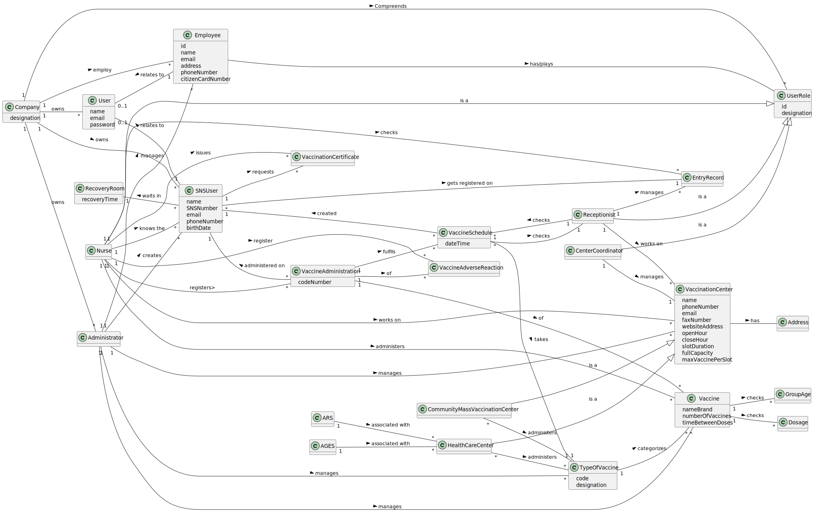

# OO Analysis #

The construction process of the domain model is based on the client specifications, especially the nouns (for _concepts_) and verbs (for _relations_) used. 

## Rationale to identify domain conceptual classes ##
To identify domain conceptual classes, start by making a list of candidate conceptual classes inspired by the list of categories suggested in the book "Applying UML and Patterns: An Introduction to Object-Oriented Analysis and Design and Iterative Development". 

### _Conceptual Class Category List_ ###

**Business Transactions**
* Vaccination administration

---

**Transaction Line Items**

* Adverse reactions line item 

---

**Product/Service related to a Transaction or Transaction Line Item**

* Vaccines
* Vaccinations
* Type of Vaccines
* Administration process 
* Age groups
* Doses
* Schedules
* Adverse Reactions
---

**Transaction Records**

* EU COVID Digital Certificate
* Schedule appointment 
* Vaccination history
* Adverse reaction

---  

**Roles of People or Organizations**

* Administrator
* Nurse
* Receptionist
* Center Coordinator
* SNS User
* Employee
---

**Places**

* Vaccination center
* Health care center
* Community Mass Vaccination Center
---

**Noteworthy Events**

* SNS User going to the center
* Vaccine Schedule
* Vaccine administrate 

---

**Physical Objects**

*Vaccine

---

**Descriptions of Things**

* Type Of Vaccine

---

**Catalogs**

*  

---

**Containers**

*  

---

**Elements of Containers**

*  

---

**Organizations**

* DGS -> Company
* SNS
* ARS
* AGES

---

**Other External/Collaborating Systems**

*  DGS's IT department

---

**Records of finance, work, contracts, legal matters**

* SMS messages
* Email

---

**Financial Instruments**

*  

---

**Documents mentioned/used to perform some work/**

* 
---

###**Rationale to identify associations between conceptual classes**###

An association is a relationship between instances of objects that indicates a relevant connection and that is worth of remembering, or it is derivable from the List of Common Associations: 

+ **_A_** is physically or logically part of **_B_**
+ **_A_** is physically or logically contained in/on **_B_**
+ **_A_** is a description for **_B_**
+ **_A_** known/logged/recorded/reported/captured in **_B_**
+ **_A_** uses or manages or owns **_B_**
+ **_A_** is related with a transaction (item) of **_B_**
+ etc.

| Concept (A) 		                    |    Association     |               Concept (B) |
|:----------------------------------|:------------------:|--------------------------:|
| Company  	                        |        owns        |                  Employee | 
| Company  	                        |        owns        |                  SNS User | 
| Administrator                     |      manages       |           Type Of Vaccine | 
| Administrator                     |      manages       |                   Vaccine | 
| Administrator                     |      manages       |        Vaccination Center | 
| Administrator                     |      manages       |                  Employee | 
| Administrator                     |        is a        |                  Employee | 
| Administrator                     |      creates       |                  SNS User | 
| Nurse                             |        is a        |                  Employee | 
| Receptionist                      |        is a        |                  Employee | 
| Center Coordinator                |        is a        |                  Employee | 
| Health Care Center                |        is a        |        Vaccination Center | 
| Health Care Center                | is associated with |                       ARS | 
| Health Care Center                | is associated with |                      AGES | 
| Health Care Center                |    administers     |           Type of vaccine | 
| Community Mass Vaccination Center |        is a        |        Vaccination Center | 
| Community Mass Vaccination Center |    administers     |           Type of vaccine | 
| Type of vaccine                   |    categorizes     |                   Vaccine | 
| Nurse                             |    administers     |                   Vaccine | 
| Nurse                             |      works on      |        Vaccination Center | 
| Nurse                             |       issues       |   Vaccination Certificate | 
| Nurse  	                          |     knows the	     |                  SNS User | 
| Nurse  	                          |      register      | Vaccine Adverse Reactions | 
| Receptionist                      |      works on      |        Vaccination Center | 
| Receptionist	                     |     checks   	     |          Vaccine Schedule | 
| Receptionist  	                   |      manages       |              Entry Record | 
| Center Coordinator                |      works on      |        Vaccination Center | 
| SNS User                          |      requests      |   Vaccination Certificate | 
| SNS User  	                       |     created by     |             Administrator | 
| SNS User  	                       | gets registered on |              Entry Record | 
| SNS User  	                       |    waits in  	     |             Recovery Room | 
| Vaccine Schedule                  |    created for     |                  SNS User | 
| Vaccine Schedule  	               |       takes        |           Type Of Vaccine |

## Domain Model

**Do NOT forget to identify concepts attributes too.**

**Insert below the Domain Model Diagram in an SVG format**

