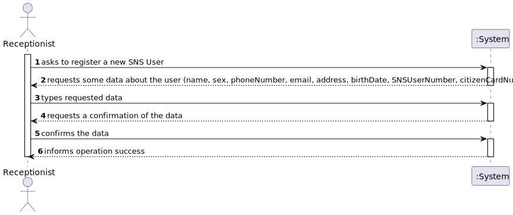
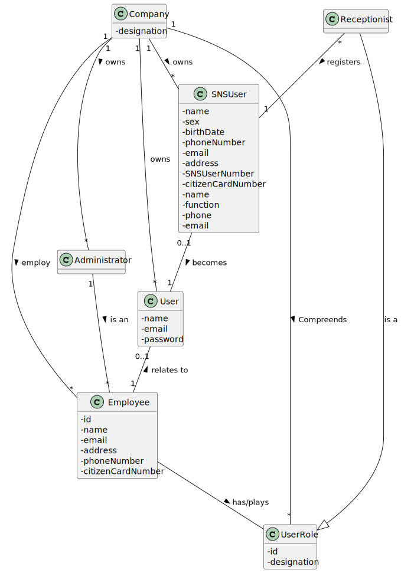
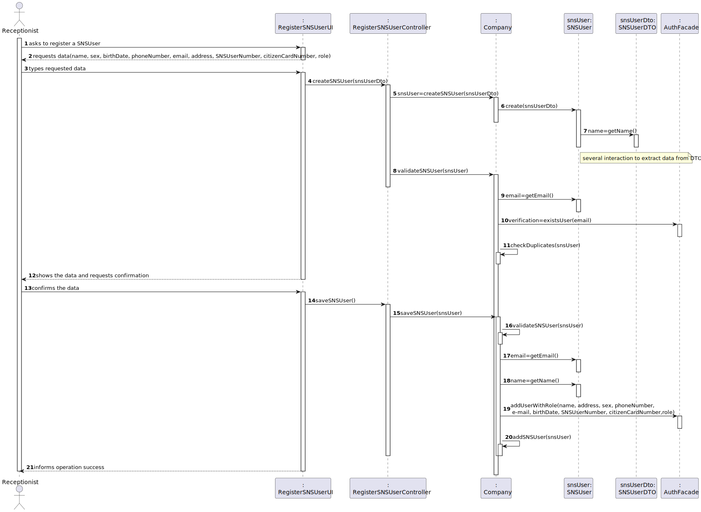
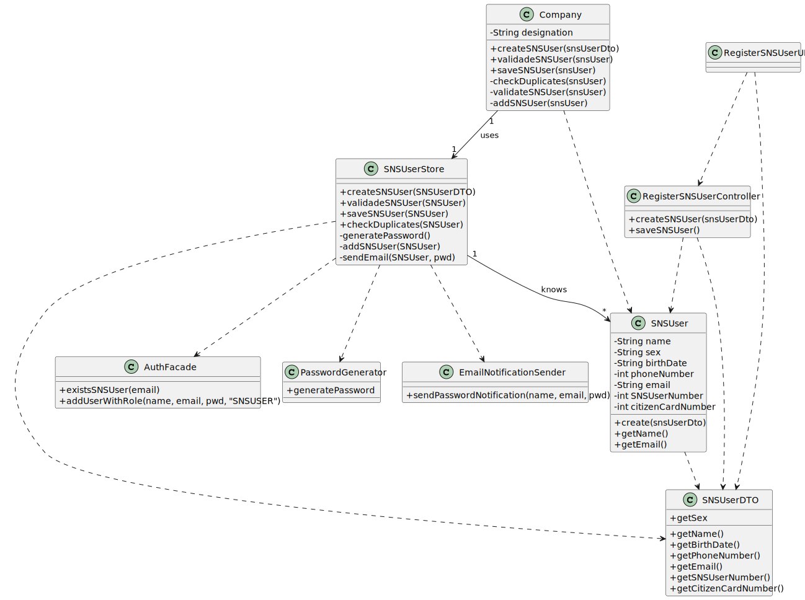

# US 003 - As a receptionist, I want to register an SNS User

## 1. Requirements Engineering

### 1.1. User Story Description

As a receptionist, I want to register a SNS User

### 1.2. Customer Specifications and Clarifications 

**From the specifications document:**

> Some users (e.g.: older ones) may want to go to a healthcare center to schedule the vaccine appointment with the help of a receptionist at one vaccination center.
 	
>   A receptionist is responsible for the registration of the arrival of the SNS user that is going to take the specified vaccine.

>	The receptionist asks the SNS User for his/her SNS User number and confirms that he/she has the vaccine scheduled for that day and time.                                                     

>	If this information is correct, the receptionist acknowledges the system that user is ready to take the vaccine

**From the client clarifications:**

> **Question:** What are the necessary components in order to register an SNS User?
>  
> **Answer:** The attributes that should be used to describe a SNS user are: name, address, sex, phone number, e-mail, birth date, SNS User number and citizen card number. The sex attribute is optional. All other fields are required. The e-mail, phone number, citizen card number and SNS user number should be unique for each SNS user.

> **Question:** There we can read "US03 - As a receptionist, I want to register a SNS User." Accordingly to our project description, the person allowed to register a SNS User it's the DGS Administrator
>  
> **Answer:** There is no error. We will have two User Stories for registering SNS users. One of these USs is US03 and the other US will be introduced later, in Sprint C.

> **Question:** In terms of the atributes that you have pointed out i would like to know the limit and rules of those atributes (EX: Phonenumber, birthdate,etc).

 
> ### 1.3. Acceptance Criteria
> **Answer:** During Sprint B I will not introduce attribute rules/formats other than the ones that I already introduced (in this forum or in the project description). Please study the concepts and define appropriate formats for the attributes.

* **AC1:** The SNS User must become a system user. The "auth" component available on the repository must be reused (without modifications).
* **AC2:** The e-mail, phone number, citizen card number and SNS user number should be unique for each SNS User.

### 1.4. Found out Dependencies

* There is a dependency to "US10 Register an employee" as a user can only be created if there is a receptionist.
* There is a dependency for user data, as a user can only be created if it has data.

### 1.5 Input and Output Data

**Input Data:**

* Typed data:
    * name
    * sex
    * phone number
    * email
    * address
    * citizen card number
    * birth date
	
* Selected data:
	* (none)

**Output Data:**

* (In)Success of the operation

### 1.6. System Sequence Diagram (SSD)

**Alternative 1**

**Other alternatives might exist.**

### 1.7 Other Relevant Remarks

* The created task stays in a "not published" state in order to distinguish from "published" tasks.

## 2. OO Analysis

### 2.1. Relevant Domain Model Excerpt 

### 2.2. Other Remarks

n/a

## 3. Design - User Story Realization 

### 3.1. Rationale

**SSD - Alternative 1 is adopted.**

| Interaction ID | Question: Which class is responsible for...          | Answer                    | Justification (with patterns)                                                                                                                                                                                                                                               |
|:---------------|:-----------------------------------------------------|:--------------------------|:----------------------------------------------------------------------------------------------------------------------------------------------------------------------------------------------------------------------------------------------------------------------------|
| Step 1         | 	... interacting with the actor?                     | RegisterSNSUserUI         | **Pure Fabrication:** there is no reason to assign this responsibility to any existing class in the Domain Model                                                                                                                                                            |
| 			  		        | 	... coordinating the US?                            | RegisterSNSUserController | **Controller**                                                                                                                                                                                                                                                              |
| Step 2         | 							                                              |                           |                                                                                                                                                                                                                                                                             |
| Step 3         | 	...transfer the data typed in the UI to the domain? | SNSUserDto                | **DTO:** When there is so much data to transfer, it is better to opt by using a DTO in order to reduce coupling between UI and domain                                                                                                                                       |
|                | 	...saving the typed data?                           | SNSUser                   | **IE:** a client knows its own data 						                                                                                                                                                                                                                                  |             |                              |
| 		             | 	... instantiating a new Client?                     | ClientStore               | **Creator (R1)** and **HC+LC**: By the application of the Creator (R1) it would be the "Company". But, by applying HC + LC to the "Company", this delegates that responsibility to the "ClientStore"                                                                        |
| 		 			         | ... knows ClientStore?	                              | Company                   | **IE:** Company knows the ClientStore to which it is delegating some tasks                                                                                                                                                                                                  |
| 		             | 	... validating all data (local vzalidation)?        | SNSUser                   | **IE:** an object knows its data                                                                                                                                                                                                                                            |
| 			  		        | 	... validating all data (global validation)?        | SNSUserStore              | **IE:** knows all the clients                                                                                                                                                                                                                                               | 
|                | ... validate the exclusivity of the client's email?  | AuthFacade                | **IE:** user management is responsibility of the respective external component whose point of interaction is through the class "AuthFacade"                                                                                                                                 |
| Step 4         | 	                                                    |                           |                                                                                                                                                                                                                                                                             |        
| Step 5         | 	... generating the password?                        | PasswordGenerator         | **IE** and **Pure Fabrication:** SNSuserStore has all the required information and means to generate the password (IE). However, to avoid code duplication (cf. US7) this responsibility might be assign to a common and shared artificial class, specialized in this task. |
| 			  		        | 	... registering the client as a system user?        | AuthFacade                | **IE:** cf. A&A component documentation                                                                                                                                                                                                                                     | 
| 			  		        | 	... saving the client?                              | SNSUserStore              | **IE:** Knows all clients                                                                                                                                                                                                                                                   | 
| 			  		        | 	... sending email?                                  | EmailNotificationSender   | **IE** and **Pure Fabrication:** has all the required information and means to send the email (IE). However, to avoid code duplication (cf. US7) this responsibility might be assign to a common and shared artificial class, specialized in this task.                     | 
| Step 6         | 	... informing operation success?                    | RegisterClientUI          | **IE:** is responsible for user interactions                                                                                                                                                                                                                                | 

### Systematization ##

According to the taken rationale, the conceptual classes promoted to software classes are:

* Company
* SNSUser

Other software classes (i.e. Pure Fabrication) identified:

* RegisterSNSUserUI
* RegisterSNSUserController
* SNSUserDTO

Other software classes of external systems/components:

* AuthFacade

## 3.2. Sequence Diagram (SD)

## 3.3. Class Diagram (CD)

# 4. Tests 

**Test 1:** Check that it is not possible to create an instance of the Task class with null values. 

	@Test(expected = IllegalArgumentException.class)
		public void ensureNullIsNotAllowed() {
		Task instance = new Task(null, null, null, null, null, null, null);
	}
	

**Test 2:** Check that it is not possible to create an instance of the Task class with a reference containing less than five chars - AC2. 

	@Test(expected = IllegalArgumentException.class)
		public void ensureReferenceMeetsAC2() {
		Category cat = new Category(10, "Category 10");
		
		Task instance = new Task("Ab1", "Task Description", "Informal Data", "Technical Data", 3, 3780, cat);
	}

*It is also recommended to organize this content by subsections.* 

# 5. Construction (Implementation)

## Class CreateTaskController 

		public boolean createTask(String ref, String designation, String informalDesc, 
			String technicalDesc, Integer duration, Double cost, Integer catId)() {
		
			Category cat = this.platform.getCategoryById(catId);
			
			Organization org;
			// ... (omitted)
			
			this.task = org.createTask(ref, designation, informalDesc, technicalDesc, duration, cost, cat);
			
			return (this.task != null);
		}

## Class Organization

		public Task createTask(String ref, String designation, String informalDesc, 
			String technicalDesc, Integer duration, Double cost, Category cat)() {
		
	
			Task task = new Task(ref, designation, informalDesc, technicalDesc, duration, cost, cat);
			if (this.validateTask(task))
				return task;
			return null;
		}

# 6. Integration and Demo 

* A new option on the Employee menu options was added.

* Some demo purposes some tasks are bootstrapped while system starts.

# 7. Observations

Platform and Organization classes are getting too many responsibilities due to IE pattern and, therefore, they are becoming huge and harder to maintain. 

Is there any way to avoid this to happen?

