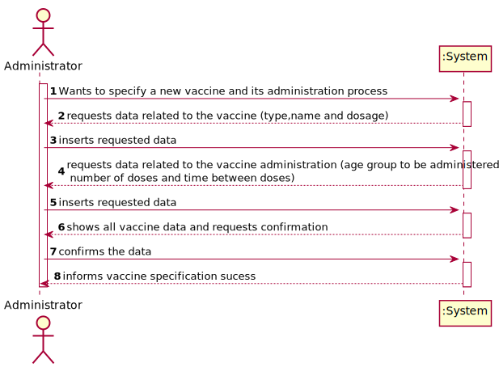
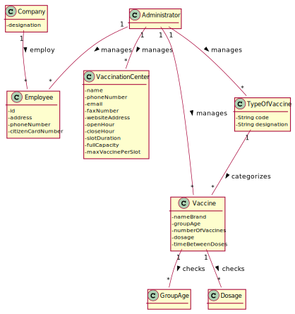
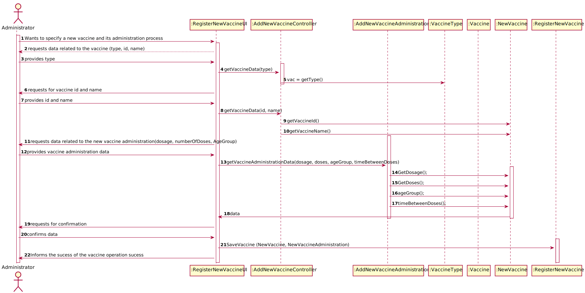
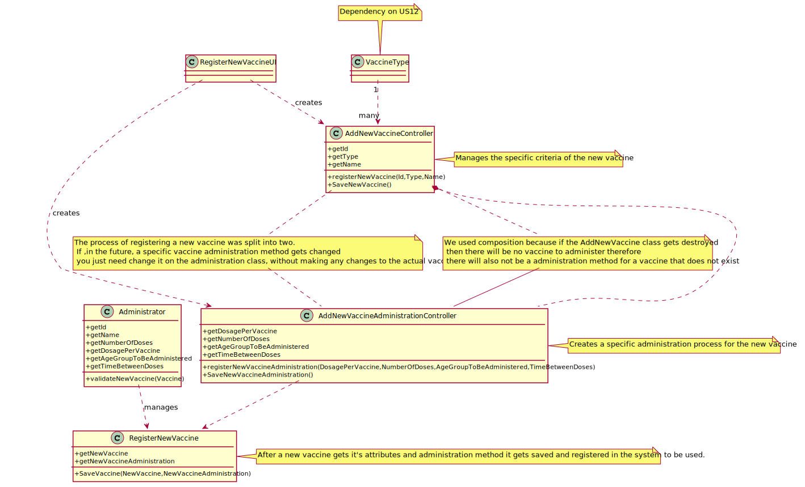

# US 006 - To create a Task 

## 1. Requirements Engineering

### 1.1. User Story Description

As an administrator, I intend to specify a new vaccine and its new administration process.

### 1.2. Customer Specifications and Clarifications 

**From the specifications document:**

> Yet, it is worth noticing that for each type of vaccine, several vaccines might exist, each one
demanding a distinct administration process. For instance, for the Covid-19 type, there is (i) the
Pfizer vaccine, (ii) the Moderna vaccine, (iii) the Astra Zeneca vaccine, and so on. 
> The vaccine administration process comprises (i) one or more age groups (e.g.: 5 to 12 years old, 13 to 18 years
old, greater than 18 years old), and (ii) per age group, the doses to be administered (e.g.: 1, 2, 3), the
vaccine dosage (e.g.: 30 ml), and the time interval regarding the previously administered dose.
> Regarding this, it is important to notice that between doses (e.g.: between the 1st and 2nd doses) the
dosage to be administered might vary as well as the time interval elapsing between two consecutive
doses (e.g.: between the 1st and 2nd doses 21 days might be required, while between the 2nd and the
3rd doses 6 months might be required).

> An Administrator is responsible for properly configuring and managing the core information (e.g.:
type of vaccines, vaccines, vaccination centers, employees) required for this application to be
operated daily by SNS users, nurses, receptionists, etc

**From the client clarifications:**

>**Question:** As to the interval between doses, what time format are we to use (e.g. days, months, weeks)?
> 
> **Answer:** The time format to be used is days.

>**Question:**  Is there any data that characterizes the vaccine administration process as well as business rules or acceptance criteria related to that data?
>
> **Answer:** This question still hasn't been replied. 

> **Question:** Can the vaccine administration process only be registered simultaneously with the creation of the vaccine or can it be added later? 
>
> **Answer:** This question still hasn't been replied.

>**Question:** Is there more data that should be inserted besides the number of doses of the vaccine and the time necessary between doses? 
>
>**Answer:** This question still hasn't been replied.

### 1.3. Acceptance Criteria

* **AC1:** For each type of vaccine several vaccines might exist.
* **AC2:** The vaccine administration comprises age, doses, time between doses and dosage.
* **AC3:** The dosage and time between doses might change.

### 1.4. Found out Dependencies

* There is a dependency to "US012 - As an administrator, I intend to specify a new vaccine type and its administration process.", since several vaccines might exist for each type of vaccine and each one of them might require different methods of administration. 

### 1.5 Input and Output Data

**Input Data:**

* Typed data:
    * id
    * name
    * type (dependency from another US)
    * number of doses to be applied
    * amount of time between doses
    * age group of administration
    * vaccine dosage (e.g.: 30ml)

	
* Selected data:
    * Vaccine

**Output Data:**

* Number of administered doses
* Number of doses yet to be administered
* (In)Sucess of the specification

### 1.6. System Sequence Diagram (SSD)

### 1.7 Other Relevant Remarks

* The created task stays in a "not published" state in order to distinguish from "published" tasks.

## 2. OO Analysis

### 2.1. Relevant Domain Model Excerpt 

### 2.2. Other Remarks

n/a

## 3. Design - User Story Realization 

### 3.1. Rationale

| Interaction ID                                                                                    | Question: Which class is responsible for...                       | Answer                     | Justification (with patterns)                                                                                             |
|:--------------------------------------------------------------------------------------------------|:------------------------------------------------------------------|:---------------------------|:--------------------------------------------------------------------------------------------------------------------------|
| Step 1 The Administrator starts to specify a new vaccine and it's administration process.         | What class interacts with the user?                               | RegisterNewVaccineUI       | Pure Fabrication, because it is not justified to assign this responsibility to any class that exists in the Domain Model. |
|                                                                                                    | What class controls the US? |AddNewVaccineController and AddNewVaccineAdministrationController| Controller
| Step 2 The system requests the available vaccine types                                            |From where does the types of vaccine come?                         |VaccineType           | Adding a new vaccine type is a completely different process to specify a new vaccine and its administration process. For a single type of vaccine, multiple vaccines might exist.|
| Step 3 The Administrator selects a type of vaccine (type)
| Step 4 The system requests the new vaccine data (Id,name) 
| Step 5 The Administrator inserts the requested data                                                |Where is the requested data stored? |NewVaccine| This class will save data related to the new vaccine|
| Step 6 The system requests data related to that vaccine administration (NumberOfDoses,Dosage ,AgeGroupToBeAdministered,TimeBetweenDoses) |
| Step 7 The Administrator inserts the requested data                                                |Where is the requested data stored? | NewVaccineAdministration | This class will save data related to the new vaccine administration|
| Step 8 The system creates a new vaccine with the vaccine and vaccine administration data.          | What class is responsible for creating the new vaccine with the new data? | RegisterNewVaccine |This class will merge the data from the AddNewVaccineType and AddNewVaccineAdministration in order to create a new complete vaccine|
| Step 9 The system shows the new vaccine and requests validation from the Administrator
| Step 10 The Administrator validates the new vaccine
| Step 11 The system saves the new vaccine and informs the success of the new vacine specification process.

### Systematization ##

According to the taken rationale, the conceptual classes promoted to software classes are: 

 * Company
 * Administrator
 * NewVaccine

Other software classes (i.e. Pure Fabrication) identified: 

 * AddNewVacineUI
 * AddNewVaccineController
 * AddNewVaccineAdministrationController
 

## 3.2. Sequence Diagram (SD)

## 3.3. Class Diagram (CD)

# 4. Tests 

**Test 1:** Check that it is not possible to create an instance of the Task class with null values. 

	@Test(expected = IllegalArgumentException.class)
		public void ensureNullIsNotAllowed() {
		Task instance = new Task(null, null, null, null, null, null, null);
	}
	

**Test 2:** Check that it is not possible to create an instance of the Task class with a reference containing less than five chars - AC2. 

	@Test(expected = IllegalArgumentException.class)
		public void ensureReferenceMeetsAC2() {
		Category cat = new Category(10, "Category 10");
		
		Task instance = new Task("Ab1", "Task Description", "Informal Data", "Technical Data", 3, 3780, cat);
	}

*It is also recommended to organize this content by subsections.* 

# 5. Construction (Implementation)

## Class CreateTaskController

		public boolean createTask(String ref, String designation, String informalDesc, 
			String technicalDesc, Integer duration, Double cost, Integer catId)() {
		
			Category cat = this.platform.getCategoryById(catId);
			
			Organization org;
			// ... (omitted)
			
			this.task = org.createTask(ref, designation, informalDesc, technicalDesc, duration, cost, cat);
			
			return (this.task != null);
		}

## Class Organization

		public Task createTask(String ref, String designation, String informalDesc, 
			String technicalDesc, Integer duration, Double cost, Category cat)() {
		
	
			Task task = new Task(ref, designation, informalDesc, technicalDesc, duration, cost, cat);
			if (this.validateTask(task))
				return task;
			return null;
		}

# 6. Integration and Demo 

* A new option on the Employee menu options was added.

* Some demo purposes some tasks are bootstrapped while system starts.

# 7. Observations

Platform and Organization classes are getting too many responsibilities due to IE pattern and, therefore, they are becoming huge and harder to maintain. 

Is there any way to avoid this to happen?

