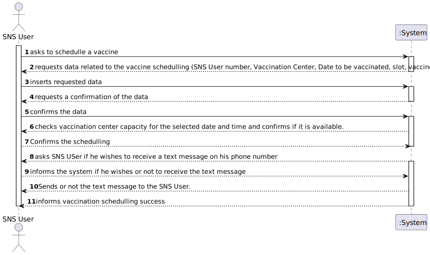

# US 001 - As a SNS user I intend to use the application to schedule a vaccine.

## 1. Requirements Engineering

### 1.1. User Story Description

As an SNS user I intend to use the application to schedule a vaccine.

### 1.2. Customer Specifications and Clarifications 

**From the specifications document:**

>   To take a vaccine, the SNS user should use the application to schedule his/her vaccination. 	

>   The user  should introduce his/her SNS user number, select the vaccination center, the date, and the time (s)he  wants to be vaccinated as well as the type of vaccine to be administered (by default, the system
suggests the one related to the ongoing outbreak)

> Then, the application should check the
vaccination center capacity for that day/time and, if possible, confirm that the vaccination is
scheduled and inform the user that (s)he should be at the selected vaccination center at the
scheduled day and time. The SNS user may also authorize the DGS to send a SMS message with
information about the scheduled appointment

> If the user authorizes the sending of the SMS, the
application should send an SMS message when the vaccination event is scheduled and registered in
the system.

**From the client clarifications:**

> **Question:** "What are the necessary components in order to register an SNS User?"
>  
> **Answer:** The attributes that should be used to describe a SNS user are: name, address, sex, phone number, e-mail, birth date, SNS User number and citizen card number. The sex attribute is optional. All other fields are required. The e-mail, phone number, citizen card number and SNS user number should be unique for each SNS user.
> 
> **Question:** "We are unsure if it's in this user stories that's asked to implement the "send a SMS message with information about the scheduled appointment" found on the Project Description available in moodle. Could you clarify?"
> 
> **Answer:** In a previous clarification that I made on this forum, I said: "[The user should receive a] SMS Message to warn of a scheduling [and the message] should include: Date, Time and vaccination center". Teams must record the answers!
A file named SMS.txt should be used to receive/record the SMS messages. We will not use a real word service to send SMSs.
> 
> **Question:** "Regarding the US01 - Should the app ask for the location where the SNS User would like to take his vaccine or should it rather suggest a vaccination center for the SNS User to go, based on the timetable chosen by the SNS User?"
> 
> **Answer:** The application should ask for a location where the SNS User wants to take the vaccine.
>

 
### 1.3. Acceptance Criteria

> * **AC1:** A SNS user cannot schedule the same vaccine more than
  once.

### 1.4. Found out Dependencies

* **US09** As an administrator, I want to register a vaccination center to respond to a certain
  pandemic
* **US12** As an administrator, I intend to specify a new vaccine type
* **US13** As an administrator, I intend to specify a new vaccine and its administration
  process.

### 1.5 Input and Output Data

**Input Data:**

* Typed data:
    * SNS User number
    * Vaccination Center
    * Date of vaccine schedule
    * Time of vaccine administration
    * Vaccine type
  

	
* Selected data:
	* (none)

**Output Data:**

* (In)Success of vaccine schedulling
* SMS message (txt file)

### 1.6. System Sequence Diagram (SSD)

### 1.7 Other Relevant Remarks

## 2. OO Analysis

### 2.1. Relevant Domain Model Excerpt 

### 2.2. Other Remarks

n/a

## 3. Design - User Story Realization 

### 3.1. Rationale

**SSD - Alternative 1 is adopted.**

| Interaction ID                                                      | Question: Which class is responsible for... | Answer                                            | Justification (with patterns)                                                                                    |
|:--------------------------------------------------------------------|:--------------------------------------------|:--------------------------------------------------|:-----------------------------------------------------------------------------------------------------------------|
| Step 1 :   The SNS User wants to schedule a vaccine using the app   | 	... interacting with the user?             | ScheduleVaccineUI                                 | **Pure Fabrication:** there is no reason to assign this responsibility to any existing class in the Domain Model |
 |                                                                     | 	... coordinating the US?                   | ScheduleVaccineController                         | **Controller**                                                                                                   |
| Step 2  : Requests the SNS User number                              |                                                     
| Step 3  : Types the SNS User number                                 | 	...validating the SNS number?              | SNSUser                                           | **IE**: the object has it's own data                                                                             |
| Step 4  : Requests the vaccination center name                      | 	                                           |                                                   | 						                                                                                                           |                   |                  
| Step 5  : Types the vaccination center name                         | 	... validate the vaccination center name?  | VaccinationCenterStore                            | **IE**: knows all of the existing vaccination centers names.                                                     |
| Step 6  : Requests the date for the vaccination	                    |                                             |                                                   |                                                                                                                  |   
| Step 7 :  Types the date for the vaccine scheduling                 | 	... validate the scheduling date?          | VaccinationCenterDate                             | **IE:** an object knows its data                                                                                 |
 | Step 8 : Requests the slot to be vaccinated                         |                                             |                                                   |                                                                                                                  | 
| Step 9 : Selects the slot to be vaccinated                          | ... check if the slot is available?         | VacinationCenterDate                              | **IE:** the object has it's own data                                                                             |
| Step 10 : Requests the vaccine type to get vaccinated               | 	                                           |                                                   |                                                                                                                  |        
| Step 11 : Selects the vaccine type                                  | 	... check if the vaccine type exists?      | VaccineTypes                                      | **IE:** Store knows all of the existing vaccine types.                                                           |
| Step 12 : Assigns a random vaccine from that vaccine type           | 	... get a random vaccine                   | AddNewVaccineController                           | **Controller:**                                                                                                  | 
| Step 13  : Creates a scheduled vaccine with the requested datd      | 	... creating the scheduled vaccine?        | ScheduleVaccineController                         | **Controller**                                                                                                   | 
| Step 14  : Adds the created vaccine to a list of scheduled vaccines | 	... storing all the scheuled vaccines?     | ScheduledVaccineStore                             | **IE:** Store stores and saves all scheduled vaccines                                                            | 
| Step 15  : Validates the scheduled vaccine                          | 	... validating the vaccine?                | ScheduleVaccineController                         | **Controller**                                                                                                   | 
| Step 16  : Outputs to an external .txt file the scheduled vaccine   | 	... output the Scheduled vaccine?          | ScheduleVaccineController                         | **Controller**                                                                                                   | 

### Systematization ##

According to the taken rationale, the conceptual classes promoted to software classes are:

* Company
* SNSUser
* VaccinationCenter
* VaccineType
* Vaccine

Other software classes (i.e. Pure Fabrication) identified:

* ScheduleVaccineUI
* ScheduleVaccineController
* ScheduleVaccineStore
* SNSUserDTO

Other software classes of external systems/components:

## 3.2. Sequence Diagram (SD)

## 3.3. Class Diagram (CD)

# 4. Tests 

**Test 1:** Check that it is not possible to create a scheduled vaccine with null parameters. 

	void checkNullScheduledVaccine() {
        ScheduledVaccineController controller = App.getInstance().getCompany().getScheduledVaccineController;

        Assertions.assertThrows(NullPointerException.class, () -> {
            controller.checkScheduledVaccine(new ScheduledVaccine(null,null,null,null,null,null));
        });
    }
	

**Test 2:** Check that it is not possible to schedule the same vaccine type more than once. 

	@Test(expected = AlreadyExistsException.class)
		public void checkIfScheduleExists(ScheduledVaccine scheduledVaccine) {
		ArrayList<ScheduledVaccine> list = App.getInstance().getCompany().getScheduledVaccineStore.getListOfScheduledVaccines
        
        for (ScheduledVaccine scheduled : list){
        if (scheduled.getVaccineType.equals(scheduledVaccine.getVaccineType)
            throw Exception;
        }

	}

*It is also recommended to organize this content by subsections.* 

# 5. Construction (Implementation)

## Class ScheduleVaccineController

		public class ScheduleVaccineControler {

        private VaccinationCenter vaccinationCenter;
        private ScheduledVaccine scheduledVaccine;
        private ScheduledVaccineStore scheduledVaccineStore;
        private Company company = App.getInstance().getCompany();

        public ScheduleVaccineControler() {
            app = App.getInstance();
            scheduledVaccineStore = company.getScheduledVaccineStore();
        }

        public ScheduledVaccine getScheduledVaccine() {
            return scheduledVaccine;
        }

        public boolean saveScheduledVaccine(ScheduledVaccine scheduledVaccine) {
            return company.SaveSchedule(scheduledVaccine);
        }

        public ScheduledVaccine createScheduledVaccine(String SnsNumber, String VaccinationCenterName, LocalDate date, VaccinationCenterSlot scheduledSlot, String vaccineType, String vaccineName) {
            this.scheduledVaccine = new ScheduledVaccine(SnsNumber,VaccinationCenterName,date,scheduledSlot,vaccineType,vaccineName);
            return scheduledVaccine;
        }

        public boolean checkIfCenterExists(String name){
            boolean result = false;
            for(VaccinationCenter vacinationCenterToCheck :company.getVaccinationCenterStore().getVaccinationCenters()){
                if (vacinationCenterToCheck.getName().equals(name)){
                    result = true;
                }
            }
            return  result;
        }

        public VaccinationCenter setVaccinationCenterWithName (String name){
            for(VaccinationCenter vacinationCenterToCheck : company.getVaccinationCenterStore().getVaccinationCenters()){
                if (vacinationCenterToCheck.getName().equals(name)){
                    vaccinationCenter = vacinationCenterToCheck;
                }
            }
            return  vaccinationCenter;
        }

        public boolean ValidateScheduledVaccine(ScheduledVaccine scheduledVaccine){
            boolean result = false;
            if (checkIfCenterExists(scheduledVaccine.getVaccinationCenterName())){
                VaccinationCenter vaccinationCenter1 = setVaccinationCenterWithName(scheduledVaccine.getVaccineName());
                for (SNSUser SNSUserToCheck: company.getSnsUserStore().getSaveSNSUser()){
                    if (SNSUserToCheck.getSnsUserNumber().equals(scheduledVaccine.getSNSNumber())){
                        for (VaccinatonCenterDate dateToCheck : vaccinationCenter1.getListOfDates()){
                            if (dateToCheck.equals(scheduledVaccine.getSlot())){
                                result = true;
                            }
                        }
                    }
                }
            }
                return result;
            }
        }

## Class Company

		public class Company {

    public List<Vaccine> listOfVaccines = new ArrayList<>();
    private String designation;
    private AuthFacade authFacade;
    private EmployeeStore employeeStore;
    private SNSUserStore snsUserStore;
    private VaccineTypes Vaccinetypes;

    private VaccineType vaccinetype;
    private VaccinationCenterStore vaccinationCenterStore;
    private ScheduledVaccineStore scheduledVaccineStore;

    public Company(String designation) {
        if (StringUtils.isBlank(designation))
            throw new IllegalArgumentException("Designation cannot be blank.");

        this.designation = designation;
        this.authFacade = new AuthFacade();
        this.employeeStore = new EmployeeStore(authFacade);
        this.Vaccinetypes = new VaccineTypes();
        this.snsUserStore = new SNSUserStore(authFacade);
        this.vaccinationCenterStore = new VaccinationCenterStore();
        this.scheduledVaccineStore = new ScheduledVaccineStore();

    }

    public List<Vaccine> getListOfVaccines() {
        return listOfVaccines;
    }

    public VaccinationCenterStore getVaccinationCenterStore() {
        return vaccinationCenterStore;
    }

    public boolean SaveVaccinationCenter(VaccinationCenter vaccinationCenter) {
        return vaccinationCenterStore.saveVaccinationCenter(vaccinationCenter);
    }

    public boolean removeVaccinationCenter(VaccinationCenter vaccinationCenter) {
        return vaccinationCenterStore.deleteVaccinationCenter(vaccinationCenter);
    }

    public ScheduledVaccineStore getScheduledVaccineStore(){return scheduledVaccineStore;}

    public boolean SaveSchedule(ScheduledVaccine scheduledVaccine){
        return scheduledVaccineStore.addToList(scheduledVaccine);
    }

## Class ScheduledVaccineStore

		public class ScheduledVaccineStore {

    public ArrayList<ScheduledVaccine> listOfScheduledVaccines = new ArrayList<>();

    public ArrayList<ScheduledVaccine> getListOfScheduledVaccines() {
        return listOfScheduledVaccines;
    }

    public void setListOfScheduledVaccines(ArrayList<ScheduledVaccine> listOfScheduledVaccines) {
        this.listOfScheduledVaccines = listOfScheduledVaccines;
    }

    public boolean addToList (ScheduledVaccine scheduledVaccine){
       return this.listOfScheduledVaccines.add(scheduledVaccine);
    }

# 6. Integration and Demo 

# 7. Observations

