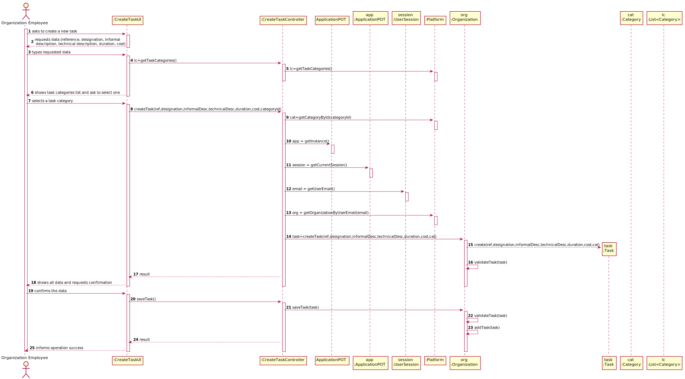

# US 006 - To create a Task 

## 1. Requirements Engineering

### 1.1. User Story Description

As an administrator, I want to get a list of Employees with a given function/role.

### 1.2. Customer Specifications and Clarifications 

**From the specifications document:**

>	 An Administrator is responsible for properly configuring and managing the core information (e.g.:
type of vaccines, vaccines, vaccination centers, employees) required for this application to be
operated daily by SNS users, nurses, receptionists, etc.

>	A receptionist registers the arrival of the user to take the respective vaccine. The receptionist asks the SNS user for his/her SNS user number and
confirms that he/she has the vaccine scheduled for the that day and time. If the information is correct, the receptionist acknowledges the system that the user is ready to take the vaccine. Then,
the receptionist should send the SNS user to a waiting room where (s)he should wait for his/her time.

>  A nurse responsible for administering the vaccine will use the application to check the list of SNS users that are present in the vaccination center to take the vaccine and will call one SNS
user to administer him/her the vaccine.The nurse checks the user info and health conditions in the system and in accordance with the scheduled vaccine type, and the SNS user vaccination history, (s)he gets system instructions regarding the vaccine to be administered (e.g.: vaccine and respective dosage considering the SNS
user age group). After giving the vaccine to the user, each nurse registers the event in the system, more precisely, registers the vaccine type (e.g.: Covid-19), vaccine name/brand (e.g.: Astra Zeneca, Moderna, Pfizer), and the lot number used. Afterwards, the nurse sends the user to a recovery room, to stay there for a given recovery period (e.g.: 30 minutes).

**From the client clarifications:**

> **Question:** Should we give the user the possibility of listing employees from more than 1 role?
>  
> **Answer:** 

-

> **Question:** Should the list be sorted in any specific way(for example alphabetical name order) or should we give the option to sort by other characteristics?
>  
> **Answer:**  

> **Question:** Is there any requirement or input that the Administrator must insert to get the list of the employees?
>
> **Answer:**

>  **Question:** What are the criteria that those employees need to meet to appear on that list?
>
> **Answer:**

> **Question:** Does the list of employees have any relevance on the functionality of the application?
>
> **Answer:**

>  **Question:**  Should we assume SNSUsers must also appear on that list?
>
> **Answer:**

>  **Question:** Should the administrator type the role he wants to see the list or select it from a list of existent roles?
>
> **Answer:**

> **Question:** In case we have in the list duplicates or triplicates (by any mistake), i.e. same names, functions, and roles, should the program be able to send the list to the admin without those duplicates or triplicates?
>
> **Answer:**

### 1.3. Acceptance Criteria

* **AC1:** All required fiels must be filled in.
* **AC2:** Task reference must have at least 5 alphanumeric chars.
* **AC3:** When creating a task with an already existing reference, the system must reject such operation and the user must have the change to modify the typed reference.

### 1.4. Found out Dependencies

* There is a dependency to "US003 Create a task category" since at least a task category must exist to classify the task being created.

### 1.5 Input and Output Data

**Input Data:**

* Typed data:
    * name
    * role 
    * function
  

	
* Selected data:
    * Role

**Output Data:**

* List of Employees with a given function/role
* (In)Success of the operation

### 1.6. System Sequence Diagram (SSD)

**Other alternatives might exist.**

### 1.7 Other Relevant Remarks

* The created task stays in a "not published" state in order to distinguish from "published" tasks.

## 2. OO Analysis

### 2.1. Relevant Domain Model Excerpt 

### 2.2. Other Remarks

n/a

## 3. Design - User Story Realization 

### 3.1. Rationale

**SSD - Alternative 1 is adopted.**

| Interaction ID | Question: Which class is responsible for... | Answer  | Justification (with patterns)  |
|:-------------  |:--------------------- |:------------|:---------------------------- |
| Step 1  		 |	... interacting with the actor? | CreateTaskUI   |  Pure Fabrication: there is no reason to assign this responsibility to any existing class in the Domain Model.           |
| 			  		 |	... coordinating the US? | CreateTaskController | Controller                             |
| 			  		 |	... instantiating a new Task? | Organization   | Creator (Rule 1): in the DM Organization has a Task.   |
| 			  		 | ... knowing the user using the system?  | UserSession  | IE: cf. A&A component documentation.  |
| 			  		 |	... knowing to which organization the user belongs to? | Platform  | IE: has registed all Organizations |
| 			  		 |							 | Organization   | IE: knows/has its own Employees|
| 			  		 |							 | Employee  | IE: knows its own data (e.g. email) |
| Step 2  		 |							 |             |                              |
| Step 3  		 |	...saving the inputted data? | Task  | IE: object created in step 1 has its own data.  |
| Step 4  		 |	...knowing the task categories to show? | Platform  | IE: Task Categories are defined by the Platform. |
| Step 5  		 |	... saving the selected category? | Task  | IE: object created in step 1 is classified in one Category.  |
| Step 6  		 |							 |             |                              |              
| Step 7  		 |	... validating all data (local validation)? | Task | IE: owns its data.| 
| 			  		 |	... validating all data (global validation)? | Organization | IE: knows all its tasks.| 
| 			  		 |	... saving the created task? | Organization | IE: owns all its tasks.| 
| Step 8  		 |	... informing operation success?| CreateTaskUI  | IE: is responsible for user interactions.  | 

### Systematization ##

According to the taken rationale, the conceptual classes promoted to software classes are: 

 * Organization
 * Platform
 * Task

Other software classes (i.e. Pure Fabrication) identified: 

 * CreateTaskUI  
 * CreateTaskController

## 3.2. Sequence Diagram (SD)

**Alternative 1**

**Alternative 2**

## 3.3. Class Diagram (CD)

**From alternative 1**

# 4. Tests 

**Test 1:** Check that it is not possible to create an instance of the Task class with null values. 

	@Test(expected = IllegalArgumentException.class)
		public void ensureNullIsNotAllowed() {
		Task instance = new Task(null, null, null, null, null, null, null);
	}
	

**Test 2:** Check that it is not possible to create an instance of the Task class with a reference containing less than five chars - AC2. 

	@Test(expected = IllegalArgumentException.class)
		public void ensureReferenceMeetsAC2() {
		Category cat = new Category(10, "Category 10");
		
		Task instance = new Task("Ab1", "Task Description", "Informal Data", "Technical Data", 3, 3780, cat);
	}

*It is also recommended to organize this content by subsections.* 

# 5. Construction (Implementation)

## Class CreateTaskController 

		public boolean createTask(String ref, String designation, String informalDesc, 
			String technicalDesc, Integer duration, Double cost, Integer catId)() {
		
			Category cat = this.platform.getCategoryById(catId);
			
			Organization org;
			// ... (omitted)
			
			this.task = org.createTask(ref, designation, informalDesc, technicalDesc, duration, cost, cat);
			
			return (this.task != null);
		}

## Class Organization

		public Task createTask(String ref, String designation, String informalDesc, 
			String technicalDesc, Integer duration, Double cost, Category cat)() {
		
	
			Task task = new Task(ref, designation, informalDesc, technicalDesc, duration, cost, cat);
			if (this.validateTask(task))
				return task;
			return null;
		}

# 6. Integration and Demo 

* A new option on the Employee menu options was added.

* Some demo purposes some tasks are bootstrapped while system starts.

# 7. Observations

Platform and Organization classes are getting too many responsibilities due to IE pattern and, therefore, they are becoming huge and harder to maintain. 

Is there any way to avoid this to happen?

