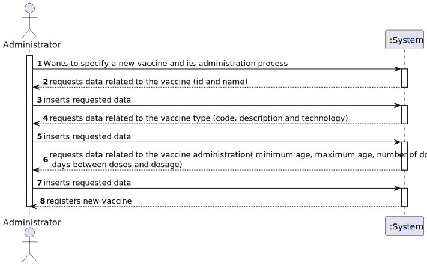
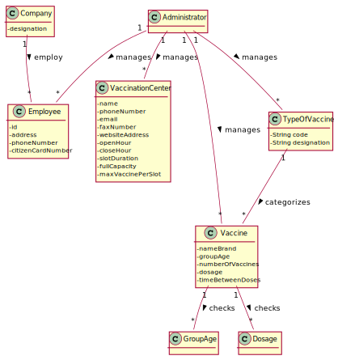
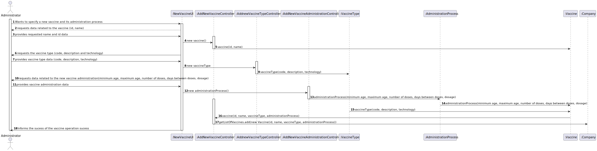
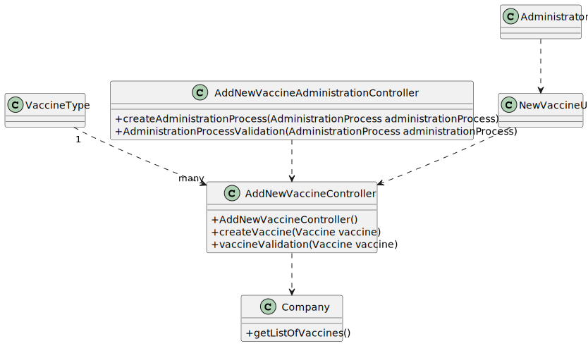

# US 013 - To specify a new vaccine and its administration process 

## 1. Requirements Engineering

### 1.1. User Story Description

As an administrator, I intend to specify a new vaccine and its new administration process.

### 1.2. Customer Specifications and Clarifications 

**From the specifications document:**

> Yet, it is worth noticing that for each type of vaccine, several vaccines might exist, each one
demanding a distinct administration process. For instance, for the Covid-19 type, there is (i) the
Pfizer vaccine, (ii) the Moderna vaccine, (iii) the Astra Zeneca vaccine, and so on. 
> The vaccine administration process comprises (i) one or more age groups (e.g.: 5 to 12 years old, 13 to 18 years
old, greater than 18 years old), and (ii) per age group, the doses to be administered (e.g.: 1, 2, 3), the
vaccine dosage (e.g.: 30 ml), and the time interval regarding the previously administered dose.
> Regarding this, it is important to notice that between doses (e.g.: between the 1st and 2nd doses) the
dosage to be administered might vary as well as the time interval elapsing between two consecutive
doses (e.g.: between the 1st and 2nd doses 21 days might be required, while between the 2nd and the
3rd doses 6 months might be required).

> An Administrator is responsible for properly configuring and managing the core information (e.g.:
type of vaccines, vaccines, vaccination centers, employees) required for this application to be
operated daily by SNS users, nurses, receptionists, etc

**From the client clarifications:**

>**Question:** As to the interval between doses, what time format are we to use (e.g. days, months, weeks)?
> 
> **Answer:** The time format to be used is days.

### 1.3. Acceptance Criteria

* **AC1:** For each type of vaccine several vaccines might exist.
* **AC2:** The vaccine administration comprises age, doses, time between doses and dosage.
* **AC3:** The dosage and time between doses might change.

### 1.4. Found out Dependencies

* There is a dependency to "US012 - As an administrator, I intend to specify a new vaccine type and its administration process.", since several vaccines might exist for each type of vaccine and each one of them might require different methods of administration. 

### 1.5 Input and Output Data

**Input Data:**

* Typed data:
    * id
    * name
    * VaccineType
    * minimum age 
    * maximum age 
    * number of doses 
    * days between doses 
    * dosage 

	
* Selected data:
    * VaccineType

**Output Data:**

* (In)Sucess of the specification

### 1.6. System Sequence Diagram (SSD)

### 1.7 Other Relevant Remarks

* The created task stays in a "not published" state in order to distinguish from "published" tasks.

## 2. OO Analysis

### 2.1. Relevant Domain Model Excerpt 

### 2.2. Other Remarks

n/a

## 3. Design - User Story Realization 

### 3.1. Rationale

| Interaction ID                                                                                                         | Question: Which class is responsible for... | Answer                                                            | Justification (with patterns)                                                                                                                                                     |
|:-----------------------------------------------------------------------------------------------------------------------|:--------------------------------------------|:------------------------------------------------------------------|:----------------------------------------------------------------------------------------------------------------------------------------------------------------------------------|
| Step 1 The Administrator wants to specify a new vaccine and it's administration process.                               | What class interacts with the user?         | NewVaccineUI                                                      | Pure Fabrication, because it is not justified to assign this responsibility to any class that exists in the Domain Model.                                                         |
|                                                                                                                        | What class controls the US?                 | AddNewVaccineController and AddNewVaccineAdministrationController | Controller                                                                                                                                                                        |
| Step 2 The system asks the Administrator for the new vaccine id and name.                                              | From where does the types of vaccine come?  | VaccineType                                                       | Adding a new vaccine type is a completely different process to specify a new vaccine and its administration process. For a single type of vaccine, multiple vaccines might exist. |
| Step 3 The Administrator inserts the vaccine id and name.                                                              |                                             |                                                                   |                                                                                                                                                                                   |
| Step 4 The system asks the Administrator if he wishes to input a new vaccine type or select one from an existing list. | From where does the type come?              | VaccineTypes                                                      | All the vaccine types added will be saved on the VaccineTypes store                                                                                                               |
| Step 5 The Administrator inserts the data related to the vaccine type ( code, description and technology ).            | Where is the requested data stored?         | vaccineType                                                       | A new vaccine type will be created with the given data                                                                                                                            |
| Step 6 The system validates the given data.                                                                            |                                             |                                                                   |                                                                                                                                                                                   |
| Step 7 The system asks the Administrator for the vaccine administration process data.                                  |                                             |                                                                   |                                                                                                                                                                                   |
| Step 8 The Administrator inserts the requested data.                                                                   | Where is the requested data stored?         | administrationProcess                                             | A new administration process will be created with the given data                                                                                                                  |
| Step 9 The system validates the given data.                                                                            |                                             |
| Step 10 The system registers the new vaccine                                                                           | Where is the vaccine saved?                 | Company                                                           | The new vaccine will be saved in the company class                                                                                                                                |         
           

### Systematization ##

According to the taken rationale, the conceptual classes promoted to software classes are: 

 * Company
 * Administrator
 * Vaccine

Other software classes (i.e. Pure Fabrication) identified: 

 * NewVacineUI
 * AddNewVaccineController
 * AddNewVaccineAdministrationController
 

## 3.2. Sequence Diagram (SD)

## 3.3. Class Diagram (CD)

# 4. Tests 

**Test 1:** Check that it is not possible to create an instance of the Task class with null values. 

	

**Test 2:** Check that it is not possible to create an instance of the Task class with a reference containing less than five chars - AC2. 

*It is also recommended to organize this content by subsections.* 

# 5. Construction (Implementation)

## Class AddNewVaccineController

## Class Vaccine

# 6. Integration and Demo 

* A new option on the Employee menu options was added.

* Some demo purposes some tasks are bootstrapped while system starts.

# 7. Observations

Platform and Organization classes are getting too many responsibilities due to IE pattern and, therefore, they are becoming huge and harder to maintain. 

Is there any way to avoid this to happen?

