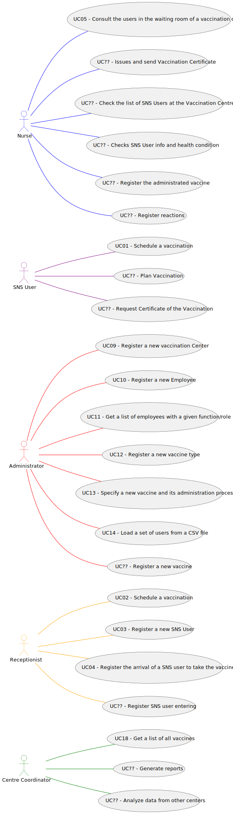

# Use Case Diagram (UCD)

**In the scope of this project, there is a direct relationship of _1 to 1_ between Use Cases (UC) and User Stories (US).**

However, be aware, this is a pedagogical simplification. On further projects and curricular units might also exist _1 to N **and/or** N to 1 relationships between US and UC.

**Insert below the Use Case Diagram in a SVG format**

**For each UC/US, it must be provided evidences of applying main activities of the software development process (requirements, analysis, design, tests and code). Gather those evidences on a separate file for each UC/US and set up a link as suggested below.**

# Use Cases / User Stories
| UC/US  | Description                                                                                                                                                                                                               |                   
|:-------|:--------------------------------------------------------------------------------------------------------------------------------------------------------------------------------------------------------------------------|
| US 3   | [I want to register a SNS user.](US001.md)                                                                                                                                                                                |
| US 9   | [I want to register a vaccination center to respond to a certain pandemic.](US002.md)                                                                                                                                     |
| US 10  | [I want to register an Employee.](US003.md)                                                                                                                                                                               |
| US 11  | [I want to get a list of Employees with a given function/role.](US004.md)                                                                                                                                                 |
| US 12  | [I intend to specify a new vaccine type.](US326.md)                                                                                                                                                                       |
| US 13  | [I intend to specify a new vaccine and its administration process.](US326.md)                                                                                                                                             |

