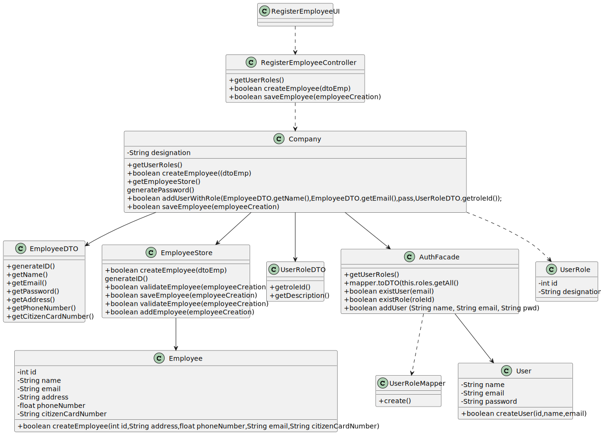

# US 10 - As an administrator, I want to register an Employee.

## 1. Requirements Engineering

### 1.1. User Story Description

As an administrator, I want to register an Employee.

### 1.2. Customer Specifications and Clarifications 

**From the specifications document:**

>An Administrator is responsible for properly configuring and managing the core information (e.g.:
type of vaccines, vaccines, vaccination centers, employees) required for this application to be
operated daily by SNS users, nurses, receptionists, etc.

>The DGS has Administrators who administer the application.

>Any Administrator uses the application to register centers, SNS users, center coordinators, receptionists, and nurses enrolled in
the vaccination process.

**From the client clarifications:**
> **Question :** 
Besides a password and a username, what other (if any) information should the Admin use to register a new employee? Are any of them optional?

> **Answer :** 
Every Employee has only one role (Coordinator, Receptionist, Nurse).
Employee attributes: Id (automatic), Name, address, phone number, e-mail and Citizen Card number.
All attributes are mandatory.

> **Question :**  
> What is the correct format for the employee's phone number and cc? Should we consider that these follow the portuguese format?
> **Answer :**
Consider that these two attributes follow the portuguese format;

> **Question :** Is the password generated automatically, or is it specified by the user operating the system?"
 > **Answer:**
The password should be generated automatically.

> **Question :** 
> you have already specified that the password for a user should be automatically generated. Is it the same case for an employee?
> **Answer :**
Yes. I already answered this question.

> **Question :** 
> How will the system user know their password, via email or a different way?"

> **Answer :**
I will not answer this question during Sprint B. I will not answer questions that require knowledge that will be introduced later, in the next sprints.

### 1.3. Acceptance Criteria

* **AC1:** Each user must have a single role defined in the system.
* **AC2:** The "auth" component available on the repository must be reused (without modifications).
* **AC2:** Each User only one Role.
* **AC2:** Must be on portuguese Format the Phone Number and Citizen Card Number.

### 1.4. Found out Dependencies

* There no dependency to "US10 I want to register an Employee".

### 1.5 Input and Output Data
**Automatic Data:**

*
    * Id (automatic)

**Input Data:**

* Typed data:

*

    * Name
    * Address
    * Phone number
    * Email 
    * Citizen Card number

* Selected data:
*
    * Role

**Output Data:**
*
    *User Role List

### 1.6. System Sequence Diagram (SSD)

### 1.7 Other Relevant Remarks

## 2. OO Analysis

### 2.1. Relevant Domain Model Excerpt 

### 2.2. Other Remarks

n/a

## 3. Design - User Story Realization 

### 3.1. Rationale

| Interaction ID                                                                                    | Question: Which class is responsible for...                           | Answer                     | Justification (with patterns)                                                                                             |
|:--------------------------------------------------------------------------------------------------|:----------------------------------------------------------------------|:---------------------------|:--------------------------------------------------------------------------------------------------------------------------|
| Step 1 The Administrator starts to register a new employee                                        | What class interacts with the user?                                   | RegisterEmployeeUI         | Pure Fabrication, because it is not justified to assign this responsibility to any class that exists in the Domain Model. |
|                                                                                                   | Which class coordinates the US?                                       | RegisterEmployeeController | Controller                                                                                                                |
|                                                                                                   | What class creates employee?                                          | EmployeeStore              | Creator                                                                                                                   |
| Step 2 The system request data(name,address,phoneNumber,email,citizenCardNumber)                  | 							                                                               |                            |                                                                                                                           |
| Step 3 The Administrator types requested data                                                     | 	Where are the entered data stored?                                   | EmployeeDTO                | Information Expert (IE)                                                                                                   |
| Step 4 The system shows Roles and ask to select one                                               | 	                                                                     |                            |                                                                                                                           |
| Step 5 The Administrator selects a role                                                           | 	Where are the entered data stored?                                   | UserRoleDTO                | Information Expert (IE)                                                                                                   |
| Step 6 The system validates and show all data and requests confirmation                           | What class validates the data of the New employee (local validation)? | Employee                   | IE: Employee has his own data                                                                                             |
|                                                                                                   | What class validates Employee data (global validation)?               | EmployeeStore              | IE: EmployeeStore has his own data                                                                                        |
| Step 7 The Administrator confirms the data                                                        | 	Checking if the user role exist in the system		                      | AuthFacade                 | IE.Records all user Roles                                                                                                 |
|                                                                                                   | Saves the user related to the created employee information.           | Company                    | IE. In the MD, the Company calls the list of Users from the AuthFacade.                                                   | 
|                                                                                                   | What class does the specified / created Employee keep?                | EmployeeStore              | IE. In the MD, the EmployeeStore contains a list of Employees.                                                            |              
| Step 8 The system records the data and informs the administrator of the success of the operation. | What class notifies?                                                  | RegisterEmployeeUI         | IE.Is Responsible for the user interactions                                                                               |

### Systematization ##

According to the taken rationale, the conceptual classes promoted to software classes are: 

 * Company
 * Employee

Other software classes (i.e. Pure Fabrication) identified: 

* RegisterEmployeeUI
* RegisterEmployeeController
* UserRoleDTO
* EmployeeStore

Other software classes of external systems/components:

* AuthFacade

## 3.2. Sequence Diagram (SD)

## 3.3. Class Diagram (CD)

# 4. Tests 

**Test 1:** Check that it is not possible to create an instance of the Task class with null values. 

class EmployeeTest {

    @Test
    void setId() {
    }

    @Test
    void setName() {
    }

    @Test
    void setAddress() {
    }

    @Test
    void setPhoneNumber() {
    }

    @Test
    void setEmail() {
    }

    @Test
    void setCitizenCardNumber() {
    }

    @Test
    void ensureNameIsValid() {
      boolean flag = Employee.checkName("joao");
        assertTrue(flag);
    }

    @Test
    void ensureAddressIsValid() {
        boolean flag = Employee.checkAddress("Rua Tio Manel");
        assertTrue(flag);
    }

    @Test
    void ensurePhoneNumberIsValid() {
        boolean flag = Employee.checkPhoneNumber(912638424);
        assertTrue(flag);
    }

    @Test
    void ensureEmailIsValid() {
        boolean flag;
        try {
            Email mail = new Email("cunha7@me.com");
            flag = true;
        } catch (IllegalArgumentException e) {
            flag = false;
        }
        assertTrue(flag);
    }

    @Test
    void ensureCitizenCardNumberIsValid() {
       boolean flag = Employee.checkCitizenCardNumber("12345678");
       assertTrue(flag);
    }

    @Test
    void ensureNameIsNotValid() {
        boolean flag = Employee.checkName("");
        assertFalse(flag);
    }

    @Test
    void ensureAddressIsNotValid() {
        boolean flag = Employee.checkAddress("");
        assertFalse(flag);
    }

    @Test
    void ensurePhoneNumberIsNotValid() {
        boolean flag = Employee.checkPhoneNumber(912424);
        assertFalse(flag);
    }

    @Test
    void ensureEmailIsNotValid() {
        boolean flag;
        try {
            Email mail = new Email("cunha7me.com");
            flag = true;
        } catch (IllegalArgumentException e) {
            flag = false;
        }
        assertFalse(flag);
    }

    @Test
    void ensureCitizenCNumberIsNotValid() {
        boolean flag = Employee.checkCitizenCardNumber("1234567899");
        assertFalse(flag);
    }

}

	

**Test 2:** Check that it is not possible to create an instance of the Task class with a reference containing less than five chars - AC2.
class EmployeeStoreTest {

    @Test
    void checkInvalidEmployeeIsNotAccepted() {
        EmployeeStore store = App.getInstance().getCompany().getEmployeeStore();

        Assertions.assertThrows(IllegalArgumentException.class, () -> {
            store.validateEmployee(new Employee(0, null, null, 0, new Email(null), null));
        });
    }

    @Test
    void checkEmployeeNotSavedIfInvalid() {
        EmployeeStore store = App.getInstance().getCompany().getEmployeeStore();

        Assertions.assertThrows(IllegalArgumentException.class, () -> {
            store.saveEmployee(new Employee(0, null, null, 0, new Email(null), null));
        });
    }

    @Test
    void checkEmployeeSavedIfValid() {
        EmployeeStore store = App.getInstance().getCompany().getEmployeeStore();

        Assertions.assertTrue(store.saveEmployee(new Employee(0, "Tiago", "Corcena do Libano", 912638424, new Email("tiago912@gmail.com"), "12345678")));
    }

    @Test
    public void ensureNullUserRoleIsNotAllowed() {

        IllegalArgumentException exception = Assertions.assertThrows(IllegalArgumentException.class, () ->{
            EmployeeStore employeeStore = App.getInstance().getCompany().getEmployeeStore();
            UserRoleDTO userRole = null;
            List<Employee> list = employeeStore.getEmployeesList(userRole);
        });

        String errorMessageExpected = "User Role does not exist..";

        Assertions.assertEquals(errorMessageExpected, exception.getMessage());
    }
}

*It is also recommended to organize this content by subsections.* 

# 5. Construction (Implementation)

## Class RegisterEmployeeController
          {
          rolesList = company.getUserRoles()
          generatePassword();
          getRolesList();
          createEmployee(EmployeeDTO employeeDTO);
          saveEmployee(Employee employee);
          addUserWithRole(EmployeeDTO employeeDTO, UserRoleDTO userRoleDTO);
          getUser(EmployeeDTO employeeDTO);
		  }

## Class Company
          { 
          rolesList=AuthFacade.getUserRoles();
          employeeCreation=EmployeeStore.createEmployee(dtoEmp);
          name=EmployeeDTO.getName();
          email=EmployeeDTO.getEmail();
          pass=generatePassword();
          roleId=UserRoleDTO.getroleId();
          addUserWithRole(name,email,pass,roleId();
          saveEmployee(EmployeeCreation);
		
       }

# 6. Integration and Demo 

* A new option on the Employee menu options was added.

* Some demo purposes some tasks are bootstrapped while system starts.

# 7. Observations

Platform and Organization classes are getting too many responsibilities due to IE pattern and, therefore, they are becoming huge and harder to maintain. 

Is there any way to avoid this to happen?

