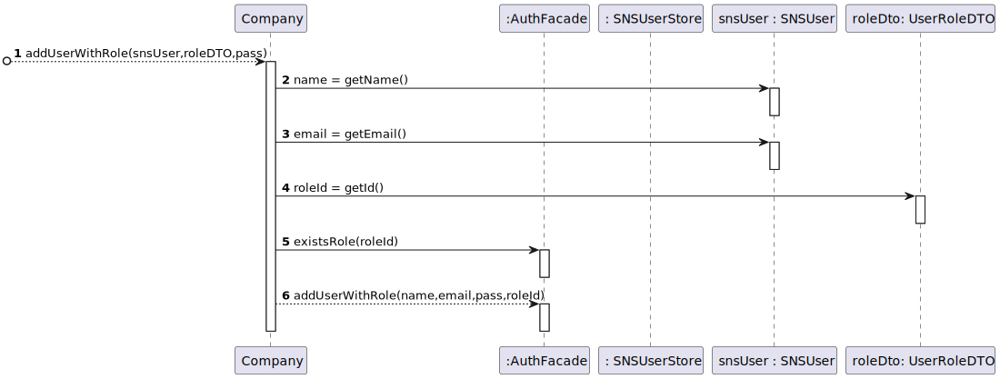

# US14: As an administrator, I want to load a set of users from a CSV file.

## 1. Requirements Engineering

As an administrator, I want to load a set of users from a CSV file.

### 1.1. User Story Description

### 1.2. Customer Specifications and Clarifications

**From the specifications document:**

>The DGS has Administrators who administer the application.

>An Administrator is responsible for properly configuring and managing the core information (e.g.:
type of vaccines, vaccines, vaccination centers, employees) required for this application to be
operated daily by SNS users, nurses, receptionists, etc.

**From the client clarifications:**

>**Question**:
Regarding US014, I would like to clarify if the CSV file only contains information about SNS users
of if the CSV file may also contain some information about employees from that vaccination center.

>**Answer**:
The CSV file only contains information about SNS users.

>**Question**:
When the admin wants to upload a CSV file to be read, should the file be stored at a
specific location on the computer (e.g. the desktop) or should the admin be able to choose the file he wants to upload in a file explorer?

>**Answer**:
The Administrator should write the file path. In Sprint C we do not ask students to develop a graphical user interface.

>**Question**:
What would be the sequence of parameters to be read on the CSV? For example: "Name | User Number".

>**Answer**:
Name, Sex, Birth Date, Address, Phone Number, E-mail, SNS User Number and Citizen Card Number.

>**Question**:
Are there any SNS User attributes that can be omitted?

>**Answer**:
I already answered one question related to US3 that answers your question.
The Sex attribute is optional (it can also take the NA value).
All other fields are required.

>**Question**:
how should the admin receive the login data/passwords for all registered users?

>**Answer**:  
During this sprint, login and password data should be presented in the console application.
In US14 the application is used to register a batch of users. For each user, all the data required to register a user should be presented in the console.

>**Question**:
Should we check if the users from the CSV file are already registered in the system?
If so, which data should we use, the one already in the system or the one on the file?

>**Answer**:
This feature of the system will be used to register a batch users.
If the user is already registered in the system, then the information available in the CSV file should not be used to register that user.

>**Question**:
 Should our application detect if the CSV file to be loaded contains the header, or should we ask the user if is submitting a file with a header or not?

>**Answer**:
 The application should automatically detect the CSV file type.

### 1.3. Acceptance Criteria

**AC1:** The application must support importing two types of CSV files:
* a)one type must have a header, column separation is done using “;”  character;
* b)the other type does not have a header, column separation is done using “,” character.

**AC2:** Parameters to be read on the CSV,Name, Sex, Birth Date, Address, Phone Number, E-mail, SNS User Number and Citizen Card Number.

**AC3:** The Administrator should write the file path.

**AC4:** The CSV file only contains information about SNS users.

**AC5:**  If the user is already registered in the system, then the information available in the CSV file should not be used to register that user.

**AC6:**  In US14 the application is used to register a batch of users. For each user, all the data required to register a user should be presented in the console.

**AC7:** The Sex attribute is optional (it can also take the NA value).

**AC8:** The Application should detect the type of file automatic.

### 1.4. Found out Dependencies

* There is  dependency to US03: As a receptionist, I want to register a SNS User.

### 1.5 Input and Output Data

**Input Data:**

**Typed data:**

* The file path of CSV file with the SNS Users to be added in the system.

**Selected data:**
* Confirmation

**Output Data:**

* List of SNS Users and the app Password.
* (In)Success of the operation.

### 1.6. System Sequence Diagram (SSD)

### 1.7 Other Relevant Remarks

n/a.

## 2. OO Analysis

### 2.1. Relevant Domain Model Excerpt

### 2.2. Other Remarks

n/a.

## 3. Design - User Story Realization

### 3.1. Rationale

**The rationale grounds on the SSD interactions and the identified input/output data.**

| Interaction ID                                                                      | Question: Which class is responsible for...                              | Answer                | Justification (with patterns)            |
|:------------------------------------------------------------------------------------|:-------------------------------------------------------------------------|:----------------------|:-----------------------------------------|
| Step 1: asks to load a set of users from a CSV file  		                             | 	... interacting with the actor?                                         | LoadSNSUserUI         | Pure Fabrication                         |
| 		                                                                                  | 	... coordinating the US? 					                                          | LoadSNSUserController | Controller                               |
| Step 2: requests the path of the CSV file  		                                       | 	n/a						                                                               |                       |                                          |
| Step 3: types the CSV file path  		                                                 | 	...	validating the file path?					                                      | Company               | Pure Fabrication                         |
|                                                                                     | ... creating the file object?                                            | LoadSNSUserController | Creator (Rule 4)                         |
|                                                                                     | ... saving the information of the file?                                  | BufferedReader        | IE: the object created has its own data  |
|                                                                                     | ... validating the file object?                                          | SNSUserStore          | Pure Fabrication                         |
|                                                                                     | ... creating a new SNS user based on the information of the file object? | SNSUserStore          | Creator (Rule 1)                         |
|                                                                                     | ... validating the information of a SNS user (local validation)          | SNSUser               | IE: the object has its own data          | 
|                                                                                     | ... validating the information of a SNS user (global validation)         | SNSUserStore          | IE: know all its SNS users               |
| Step 4: shows the users that are present in the file and requests a confirmation  	 | ... creating a list of all the SNS users found in the file object?						 | SNSUserStore          | Pure Fabrication                         |
|                                                                                     | ... showing the list of all the SNS users found in the file object?      | LoadSNSUserUI         | IE: has the list of all the users        |
| Step 5: confirms the users  		                                                      | ... generating a new password for a SNS user?							                     | Company               | IE: the object has its own data          |
|                                                                                     | ... saving a created SNS user?                                           | SNSUserStore          | IE: records all the SNS users            |
|                                                                                     | ... checking if the specified role exists?                               | AuthFacade            | IE: records all the user roles           |
|                                                                                     | ... saving a new user in the system related with a created SNS user?     | Company               | IE: records all the users                |
| Step 6: informs operation success  		                                               | ... informing operation success?							                                  | LoadSNSUserUI         | IE: is responsible for user interactions |              

### Systematization ##

According to the taken rationale, the conceptual classes promoted to software classes are:

* Company
* SNSUser

Other software classes (i.e. Pure Fabrication) identified:
* LoadSNSUserUI
* LoadSNSUserController
* SNSUserStore
* BufferedReader
* AuthFacade

## 3.2. Sequence Diagram (SD)

 Sequence Diagram:

Sequence Diagram that is repeated on US3 and belongs on the  Sequence Diagram  :

## 3.3. Class Diagram (CD)

# 4. Tests

**Test 1:** Check that it is not possible to create an instance of the Task class with null values.

    void checkSNSUserIsNotAccepted() {
        SNSUserStore store = App.getInstance().getCompany().getSnsUserStore();

        Assertions.assertThrows(NullPointerException.class, () -> {
            store.checkSNSUser(new SNSUser(null,null,null,null,null,null,null,null));
        });
    }

**Test 2:** Check that if is  possible to load a csv with valid information with Header.

      void testConvertFileSNSUserToArrayListWithValidCSVHeader() throws IOException {
      SNSUserStore store = App.getInstance().getCompany().getSnsUserStore();
      ArrayList<SNSUser> test = new ArrayList<>();
      test.add(new SNSUser("Jorge","Rua Jose","Male","912638424","cunha7@me.com","27-11-2000","123456789","12345678"));

        File br = new File("Exemplo1.csv");
        BufferedReader file = new BufferedReader(new FileReader(br));;

        ArrayList<SNSUser> test2 =store.convertFileSNSUserToArrayList(file, TYPE_WITH_HEADER);
        Assertions.assertEquals(test,test2);
    }

**Test 3:** Check that if is  possible to load a csv with valid information without Header.

         void testConvertFileSNSUserToArrayListWithValidCSVWithoutHeader() throws IOException {
        SNSUserStore store = App.getInstance().getCompany().getSnsUserStore();
        ArrayList<SNSUser> test = new ArrayList<>();
        test.add(new SNSUser("ruben","rua da bela","Male","912861639","ruben@gmail.com","01-05-2003","987654321","87654321"));

        File br = new File("Exemplo2.csv");
        BufferedReader file = new BufferedReader(new FileReader(br));;

        ArrayList<SNSUser> test2 =store.convertFileSNSUserToArrayList(file, TYPE_WITHOUT_HEADER);
        Assertions.assertEquals(test,test2);
    }

**Test 4:** Check Type of CSV that comes True
        
        void verifyTypeofCSVTrue() throws FileNotFoundException {
        boolean flag ;
        Company company =  App.getInstance().getCompany();

        File br = new File("Exemplo1.csv");
        BufferedReader file = new BufferedReader(new FileReader(br));

        try {
            company.VerifyTypeofCSV(file);
            flag = true;
        } catch (InvalidPreferencesFormatException | IOException e) {
            flag = false;
        }
        assertTrue(flag);
    }

**Test 5:** Check Type of CSV that comes False

        void verifyTypeofCSVFalse() throws FileNotFoundException {
        boolean flag ;
        Company company =  App.getInstance().getCompany();

        File br = new File("ExemploInvalido.csv");
        BufferedReader file = new BufferedReader(new FileReader(br));
        try {
            company.VerifyTypeofCSV(file);
            flag = true;
        } catch (InvalidPreferencesFormatException | IOException e) {
            flag = false;
        }
        assertFalse(flag);
    }

**Test 6:** Check location True

    void checkLocationTrue() throws IOException {
        Company company =  App.getInstance().getCompany();
        boolean flag = company.checkLocation("Exemplo1.csv") ;

        assertTrue(flag);
    }

**Test 7:** Check location False

    void checkLocationFalse() throws IOException {
        Company company =  App.getInstance().getCompany();
        boolean flag = company.checkLocation("Exemplofafafa.csv") ;

        assertFalse(flag);
    }

**Test 8:** Check SNS User File Attributes Per Line True

    void checkSNSUsersFileAttributesPerLineTrue() {
        String[] lineAttributes = new String[8];
        lineAttributes[0] = "Jorge";
        lineAttributes[1] = "Male";
        lineAttributes[2] = "27-11-2000";
        lineAttributes[3] = "Rua Josa";
        lineAttributes[4] = "912638444";
        lineAttributes[5] = "kfafa@eam.com";
        lineAttributes[6] = "123456777";
        lineAttributes[7] = "12344321";

        int lineNumber = 0;
        boolean flag = true;
        try {
            SNSUser.checkSNSUsersFileAttributesPerLine(lineAttributes,lineNumber);
        }catch (IllegalArgumentException e){
            flag = false;
        }

        assertTrue(flag);
    }

*It is also recommended to organize this content by subsections.*

# 5. Construction (Implementation)

## Class LoadSNSUserController

    ArrayList<SNSUser> user = new ArrayList<>();
    ArrayList<String> password = new ArrayList<>();

    private Company company;
    
    private SNSUserStore storeSNSUser;
    
    public ArrayList<SNSUser> ListSNSUser() {
        return storeSNSUser.snsUserList;
    }

    public LoadSNSUserController() {
        company = App.getInstance().getCompany();
        this.storeSNSUser = company.getSnsUserStore();
    }

    public ArrayList<SNSUser> createSNSUserFromCSV(String location) throws IOException {
        boolean flag = company.checkLocation(location);
        if (flag) {
            File br = new File(location);
            BufferedReader file = new BufferedReader(new FileReader(br));

            int type = company.VerifyTypeofCSV(file);
            file = new BufferedReader(new FileReader(br));

            try {
                snsUserAuxList = storeSNSUser.convertFileSNSUserToArrayList(file, type);
            } catch (RuntimeException e) {
                throw new RuntimeException(e.getMessage());
            }
        } else throw (new IOException("File Path is invalid!"));
        return snsUserAuxList;
    }

    public boolean saveSNSUsersListFromCSVFile(ArrayList<SNSUser> snsUserAuxArrayList) {
        boolean flag = false, tag = false;

        UserRoleDTO roleDto = new UserRoleDTO(Constants.ROLE_SNS_USER, Constants.ROLE_SNS_USER);

        for (SNSUser aux : snsUserAuxArrayList) {

            if (storeSNSUser.checkSNSUser(aux)) {
                flag = storeSNSUser.addSNSUser(aux);
                String pass = Company.generatePassword();
                tag = company.addUserWithRole(aux, roleDto,pass);
                if(flag && tag ){
                   user.add(aux);
                   password.add(pass);
                   printInfoUser();
                }
            }
        }
        return flag && tag;
    }

## Class Company

    private String designation;
    private AuthFacade authFacade;
    private SNSUserStore snsUserStore;
    

        public Company(String designation) {
        if (StringUtils.isBlank(designation))
            throw new IllegalArgumentException("Designation cannot be blank.");

        this.designation = designation;
        this.authFacade = new AuthFacade();
        this.employeeStore = new EmployeeStore(authFacade);
        this.Vaccinetypes = new VaccineTypes();
        this.snsUserStore = new SNSUserStore(authFacade);
        this.vaccinationCenterStore = new VaccinationCenterStore();
        this.scheduledVaccineStore = new ScheduledVaccineStore();

    }

    public List<UserRoleDTO> getUserRoles() {
        return getAuthFacade().getUserRoles();
    }

    public EmployeeStore getEmployeeStore() {
        return employeeStore;
    }

 
    public String getDesignation() {
        return designation;
    }

    public AuthFacade getAuthFacade() {
        return authFacade;
    }

    public boolean addUserWithRole(SNSUser aux, UserRoleDTO roleDto, String pass) {
        return authFacade.addUserWithRole(aux.getName(), aux.getEmail(), pass, roleDto.getId());
    }

    public boolean checkLocation(String location) throws IOException {
        Path path = Paths.get(location);
        return Files.exists(path);
    }

 
    public int VerifyTypeofCSV(BufferedReader file) throws IOException {
        String lineAux = file.readLine();
        if (lineAux.contains(",")) {
            return TYPE_WITHOUT_HEADER;
        } else {
            return TYPE_WITH_HEADER;
        }
    }

    public SNSUserStore getSnsUserStore() {
        return snsUserStore;
    }

    public boolean saveSNSUser(SNSUser snsUser) {

        return snsUserStore.saveSNSUser(snsUser);
    }

# 6. Integration and Demo

* A new option on the Admin menu options was added .
* It loads SNS Users from csv file,with check of the type of csv file.
* It was needed to remake the US3 because of the high cohesion and low coupling and where missing the checks.

# 7. Observations

