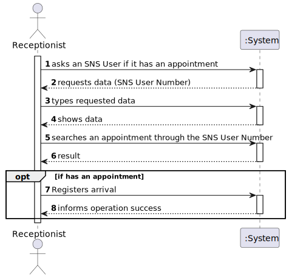
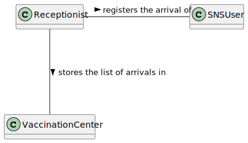
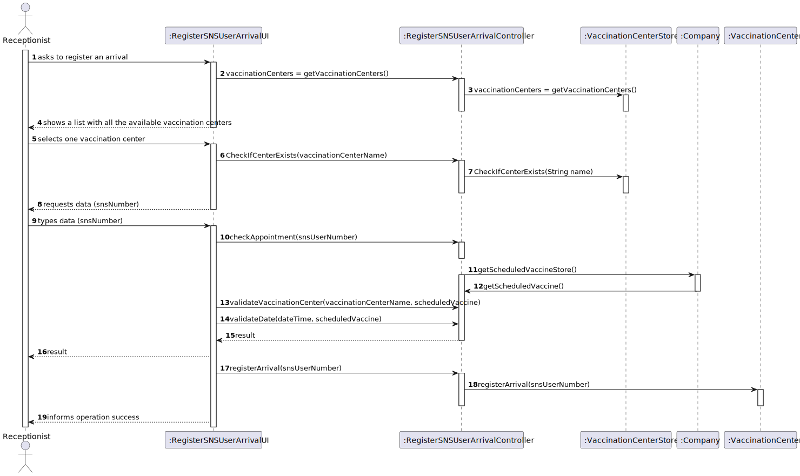
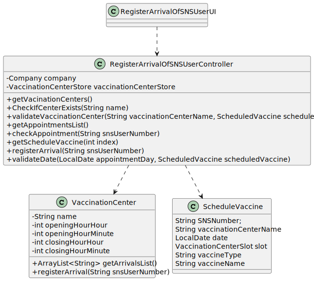

# US 15 - Check and Export Vaccination Statisctics to a CSV File.
## 1. Requirements Engineering

### 1.1. User Story Description

As a center coordinator, I intend to check and export vaccination statistics. I want to export, to a csv file, the total number of fully vaccinated users per day.

### 1.2. Customer Specifications and Clarifications 

**From the specifications document:**

Each vaccination center has a Center Coordinator that has the responsibility to manage the Covid -
19 vaccination process. The Center Coordinator wants to monitor the vaccination process, to see
statistics and charts, to evaluate the performance of the vaccination process, generate reports and
analyze data from other centers, including data from legacy systems. The goal of the performance
analysis is to decrease the number of clients in the center, from the moment they register at the
arrival, until the moment they receive the SMS informing they can leave the vaccination center. To
evaluate this, it proceeds as follows: for any time interval on one day, the difference between the
number of new clients arrival and the number of clients leaving the center every five-minute period
is computed.

**From the client clarifications:**

> **Question:** Is the exportation of the CSV file that contains the total number of fully vaccinated users per day, the only feature that needs to be implemented in code, for US15? 
>
> **Answer:** Yes.
> 
> **Question** Which "vaccination statistics" are you referring to?
> 
> **Answer** The output data should be the date and the number of fully vaccinated users.
> 
> **Question** In a previous answer you said "Data format: date; number of fully vaccinated user.". So our question is: -> Should we group all sns users fully vaccinated per day of different vaccine types into a total number of that day? Or should we divide the number by vaccine types?"
> 
> **Answer** The output data should be the date and the number of fully vaccinated users.
> 
> **Question** In US 15, we only need to used Anova for calculate the values or we need to put the formulas for do the same calculations that Anova do?
> 
> **Answer** This is not a question for the client. The client only wants to check the results. Please discuss this issue with MATCP teachers
> 
> **Question** I want to know what you mean about fully vaccinated, it is a person who have take all the doses that are defined for a specific vaccine?
> 
> **Answer** I already answered this question, please pay more attention to client answers. Again, a SNS user is fully vaccinated when he receives all doses of a given vaccine. A SNS user that has received a single-dose vaccine is considered fully vaccinated and will not take more doses.
> 
> **Question** In this US should the Center Coordinator check and export the Vaccination Statistics of the Center where he/she works at or should just check and export the Vaccination Statistics of all centers?
>
> **Answer** The center coordinator can only export statistics from the vaccination center that he coordinates.
> 
> **Question** 1-Should the user introduce the name of the file intended to export the vaccination statistics ?
2-Are the vaccination statistics refering only to the fully vaccinated users or refering to something more ?
> 
> **Answer** 1- The user should introduce the name of the file.
2- Only to fully vaccinated users.
> 
> **Question** 1- When exporting vaccination statistics,do we export the data from all days available in the system or does the center coordinator chooses the time interval? 2-Is there any kind of format our exported data should follow?
> 
> **Answer** The user should define a time interval (two dates).
2- Data format: date; number of fully vaccinated user.
> 

> ### 1.3. Acceptance Criteria

* **AC1:** 

### 1.4. Found out Dependencies

* There is a dependency to 

### 1.5 Input and Output Data

**Input Data:**

* Typed data:
    * Date from the to be checked day.

**Output Data:**

* (In)Success of the operation

### 1.6. System Sequence Diagram (SSD)

### 1.7 Other Relevant Remarks

No other relevant remarks

## 2. OO Analysis

### 2.1. Relevant Domain Model Excerpt 

### 2.2. Other Remarks

N/A

## 3. Design - User Story Realization 

### 3.1. Rationale

**SSD - Alternative 1 is adopted.**

| Interaction ID | Which class responsible for...                                                | Answer                             | Justification                                                                                                                                                                         |
|:---------------|:------------------------------------------------------------------------------|:-----------------------------------|:--------------------------------------------------------------------------------------------------------------------------------------------------------------------------------------|
| Step 1         | ...showing the list with all the Vaccination Centers available                | RegisterArrivalOfSNSUserUI         | **Pure Fabrication**: there is no reason to assign this responsibility to any existing class in the Domain Model.                                                                     |
|                | ...disponibilize the previous list to the RegisterArrivalOfSNSUserUI          | RegisterArrivalOfSNSUserController | **Controller:** act as a mediator between the UI and the Model. Has the responsibility of controlling the data transmission between both. It maps the user action into model updates. |   
|                | ... disponibilize the previous list to the RegisterArrivalOfSNSUserController | VaccinationCenterStore             | **IE:** The VaccinationCenterStore knows all the vaccinationsCenters, as we get a list from it.                                                                                       |
|                | ...saving the selected Vaccination Center                                     | RegisterArrivalOfSNSUserController | **IE:** the controller needs to know the selected Vaccination Center throughout the whole process of registering a arrival                                                            |
| Step 2         | ...request the sns number                                                     | RegisterArrivalOfSNSUserUI         | **Pure Fabrication**: there is no reason to assign this responsibility to any existing class in the Domain Model.                                                                     |
| Step 4         | ...check the requirements for registration                                    | RegisterArrivalOfSNSUserController | **Validation**                                                                                                                                                                        |                                                 |
|                | ...check if an User is already registered                                     | Company                            | The class Company knows all the arrivals, as it has the list that came from the VaccinationCenterStore with all the appointments                                                      | 
|                | ...get user's appointment                                                     | RegisterArrivalOfSNSUserController | The class RegisterArrivalOfSNSUserController has to know the appointment of the user therefore it can check whether or not the appointment is valid                                   |
| Step 5         | ...register the arrival of an SNS user                                        | VaccinationCenter                  | **Registration**                                                                                                                                                                      |
|                | ...saving the inputted data of the arrival                                    | VaccinationCenter                  | IE: VaccinationStore stores the List of the arrivals                                                                                                                                  |
| Step 6         | ...informing operation success                                                | RegisterArrivalOfSNSUserUI         | IE: is responsible for user interactions                                                                                                                                              |
### Systematization ##

According to the taken rationale, the conceptual classes promoted to software classes are:

* VaccinationCenterStore
* VaccinationCenter

Other software classes (i.e. Pure Fabr ication) identified:

* VaccinationStatisticsUI
* VaccinationsStatisticsController
* Company

Other software classes of external systems/components:

* AuthFacade

## 3.2. Sequence Diagram (SD)

## 3.3. Class Diagram (CD)

