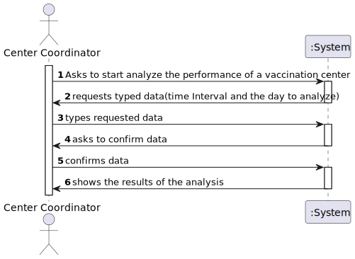
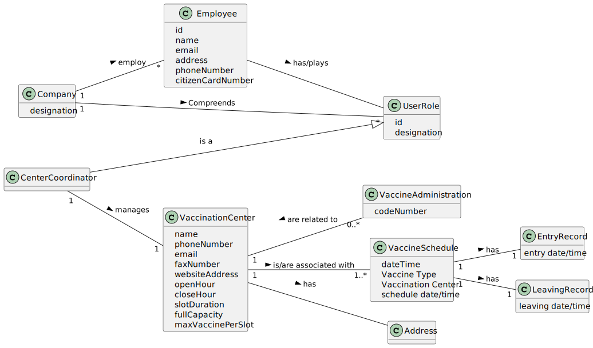
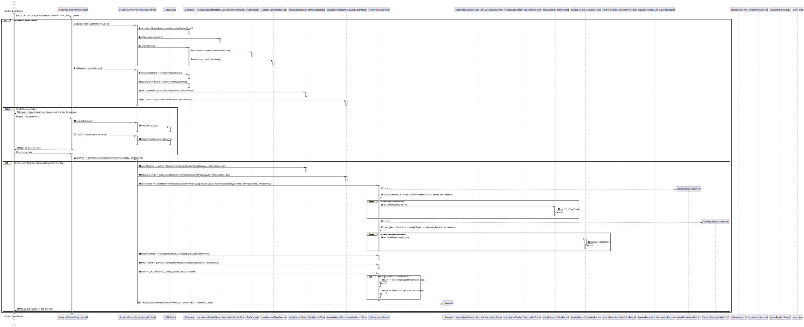
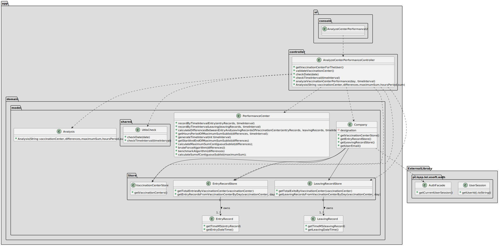

# US16: As a center coordinator, I intend to analyze the performance of a center.

## 1. Requirements Engineering

US16: As a center coordinator, I intend to analyze the performance of a center.

### 1.1. User Story Description

As a center coordinator, I intend to analyze the performance of a center.

### 1.2. Customer Specifications and Clarifications

**From the specifications document:**

The goal of this US is to implement a procedure that, for a specific day, and time intervals of m minutes (for m = 30, 20, 10, 5, and 1, for example)
chosen by the coordinator of the center, with a daily work from 8 a.m. to 8 p.m.,
the procedure creates a list of length 720/m (respectively, lists of length 24, 36, 72, 144, 720),
where the i-th value of the list is the difference between the number of new clients arriving
and the number of clients leaving the center in that i-th time interval.

Then, the application should implement a brute-force algorithm
(an algorithm which examines all the contiguous sublists of the input one) to determine the
contiguous sublist with maximum sum. The output should be the input list,
the maximum sum contiguous sublist and its sum,
and the time interval corresponding to this contiguous sublist

(for example, for time intervals of 1 hour, a list of length 12 is created; if, for example,
the maximum sum contiguous sublist starts at the 2nd and ends at the 5th entries of the input list,
with a sum s, it means that the vaccination center was less effective in responding from 9 a.m. to 1 p.m,
with s clients inside the center).

The performance analysis should be documented in the application user manual (in the annexes) that must be delivered with the application.
Also in the user manual, the implemented algorithm should be analyzed in terms of its worst-case time complexity.
The complexity analysis must be accompanied by the observation of the execution time of the algorithms,
and it should be compared to a benchmark algorithm provided,
for inputs of variable size m, with m = 24, 36, 72, 144, 720, in order to observe the asymptotic behavior.

**From the client clarifications:**

>**Question**: "From the Sprint D requirements it is possible to understand that we ought to implement a procedure that creates a 
> list with the differences between the number of new clients arriving and the number of leaving clients for each time interval. 
> My question then is, should this list strictly data from the legacy system (csv file from moodle which is loaded in US17), or should it also include data from our system?"
>**Answer**: US 16 is for all the data that exists in the system.

>**Question**: "I would like to ask that if to analyse the performance of a center, we can assume (as a pre requirement) that the center coordinator was already attributed to a specific vaccination center and proceed with the US as so (like the center coordinator does not have to choose at a certain point where he is working. This is already treated before this US happens). Could you clarify this?"
>**Answer**: A center coordinator can only coordinate one vaccination center. The center coordinator can only analyze the performance of the center that he coordinates.

>**Question**: "In US 16, should the coordinator have the option to choose which algorithm to run (e.g. via a configuration file or while running the application) in order to determine the goal sublist, or is the Benchmark Algorithm strictly for drawing comparisons with the Bruteforce one?"
>**Answer**: The algorithm to run should be defined in a configuration file.

>**Question**: "I would like to know if we could strict the user to pick only those intervals (m) (i.e. 1, 5, 10, 20, 30) as options for analyzing the performance of a center, since picking intervals is dependent on the list which is 720/m (which the length is an integer result). If we let the user pick an interval that results in a non-integer result, this will result in an invalid list since some data for the performance analysis will be lost. Can you provide a clarification on this situation?"
>**Answer**: The user can introduce any interval value. The system should validate the interval value introduced by the user.

### 1.3. Acceptance Criteria

**AC1:** US 16 is for all the data that exists in the system.

**AC2**: The output should be the input list, the maximum sum contiguous sublist and its sum, and the time interval corresponding to this contiguous sublist.

**AC3**: The center coordinator can select any time interval.

### 1.4. Found out Dependencies

* There is dependency to the 
* US 001 - As a SNS user I intend to use the application to schedule a vaccine.
* US 004 - As a receptionist at a vaccination center, I want to register the arrival of a SNS user to take the vaccine.
* US 008 -As a nurse, I want to record the administration of a vaccine to an SNS user. 
At the end of the recovery period, the user should receive an SMS message informing the SNS user he can leave the vaccination center), respectively.
* US 009 -as an administrator, I want to register a vaccination center to respond to a certain pandemic.

### 1.5 Input and Output Data

**Input Data:**

**Typed data:**
-Time Interval in minutes.
-The day to analyze
-Confirmation of the Typed Data

**Selected data:**
-Confirmation

**Output Data:**
-Results of the Analysis:
Should be the input list, the maximum sum contiguous sublist and its sum,
and the time interval corresponding to this contiguous sublist.

### 1.6. System Sequence Diagram (SSD)

### 1.7 Other Relevant Remarks

## 2. OO Analysis

### 2.1. Relevant Domain Model Excerpt

### 2.2. Other Remarks

n/a.

## 3. Design - User Story Realization

### 3.1. Rationale

**The rationale grounds on the SSD interactions and the identified input/output data.**

| Interaction ID                                                                            | Question: Which class is responsible for...                                                                        | Answer                             | Justification (with patterns)            |
|:------------------------------------------------------------------------------------------|:-------------------------------------------------------------------------------------------------------------------|:-----------------------------------|:-----------------------------------------|
| Step 1: starts to analyze the performance of a vaccination center   		                    | ... interacting with the actor?							                                                                             | AnalyseCenterPerformanceUI         | Pure Fabrication                         |
|                                                                                           | ... coordinating the US?                                                                                           | AnalyseCenterPerformanceController | Controller                               |
|                                                                                           | ... having the email of the center coordinator?                                                                    | UserSession                        | IE: the object has its own data          |
|                                                                                           | ... having the vaccination center where the center coordinator works?                                              | VaccinationCenterStore             | IE: records all the vaccination centers  |
| 		                                                                                        | ... checking if a vaccination center has entry records?							                                                     | EntryRecordStore                   | IE: records all the entry records        |
|                                                                                           | ... knowing which vaccination center is related to an entry record?                                                | ScheduledVaccine                   | IE: the object has its own data          |
| 		                                                                                        | ... checking if a vaccination center has leaving records?							                                                   | LeavingRecordStore                 | IE: records all the leaving records      |
|                                                                                           | ... knowing which vaccination center is related to a leaving record?                                               | ScheduledVaccine                   | IE: the object has its own data          |
| Step 2: requests typed data (the day to be analyzed and the time interval in minutes)  		 | n/a							                                                                                                         |                                    |                                          |
| Step 3: types requested data                                                              | ... validating the time interval entered by the user?                                                              | UtilsCheck                         | Pure Fabrication                         |
|                                                                                           | ... validating the day entered by the user?                                                                        | UtilsCheck                         | Pure Fabrication                         |
| Step 4: asks to confirm data		                                                            | n/a                                                                                                                |                                    |                                          |             
| Step 5: confirms data  		                                                                 |                                                                                                                    |                                    |                                          |
| 		                                                                                        | ... providing the entry records from a vaccination center in a specific day?							                                | EntryRecordStore                   | IE: records all the entry records        |
|                                                                                           | ... providing the leaving records from a vaccination center in a specific day?                                     | LeavingRecordStore                 | IE: records all the leaving records      |
|                                                                                           | ... splitting an entry/leaving record list by a given time interval?                                               | PerformanceCenter                  | Pure Fabrication                         |
|                                                                                           | ... having the entry hours of an entry record?                                                                     | EntryRecord                        | IE: the object has its own data          |
|                                                                                           | ... having the leaving hours of a leaving record?                                                                  | LeavingRecord                      | IE: the object has its own data          |
|                                                                                           | ... calculating the differences between the entries and exits of a vaccination center in a specific time interval? | PerformanceCenter                  | Pure Fabrication                         |
|                                                                                           | ... calculating the maximum sum contiguous sublist of the provided list of differences?                            | PerformanceCenter                  | Pure Fabrication                         |
|                                                                                           | ... calculating the sum of the maximum sum contiguous sublist?                                                     | PerformanceCenter                  | Pure Fabrication                         |
|                                                                                           | ... calculating the time interval corresponding to this contiguous sublist?                                        | PerformanceCenter                  | Pure Fabrication                         |
|                                                                                           | ... creating the Object Analysis with the information received ?                                                   | PerformanceCenter                  | creator                                  |
| Step 6: shows the results of the analysis  		                                             | ... showing the analysis results?							                                                                           | AnalyseCenterPerformanceUI         | IE: is responsible for user interactions |              

### Systematization ##

According to the taken rationale, the conceptual classes promoted to software classes are:

* EntryRecord
* LeavingRecord
* ScheduledVaccine

Other software classes (i.e. Pure Fabrication) identified:
* AnalyseCenterPerformanceUI
* AnalyseCenterPerformanceController
* UseSession
* VaccinationCenterStore
* EntryRecordStore
* LeavingRecordStore
* PerformanceCenter
* Analysis

## 3.2. Sequence Diagram (SD)

## 3.3. Class Diagram (CD)

# 4. Tests

**Test 1:** Check that it is not possible to calculate the differences between the entry and leaving records of a vaccination center if they don't exist.

	@Test
    void ensureIsNotPossibleToCalculateDifferencesWithNoEntryAndLeavingRecords() {
        // ... (omitted)
    }

**Test 2:** Check that it is possible to calculate the differences between the entry and leaving records of a vaccination center if they exist.

    @Test
    void ensureIsPossibleToCalculateDifferencesBetweenValidEntryAndLeavingRecords() {
      // ... (omitted)
    }

**Test 3:** Check that it is not possible to enter an invalid time interval.

    @Test
    void ensureTimeIntervalIsInvalid() {
      // ... (omitted)
    }

**Test 4:** Check that it is possible to enter a valid time interval.

    @Test
    void ensureTimeIntervalIsValid() {
      // ... (omitted)
    }

**Test 5:** Check that it is not possible to enter an invalid day.

    @Test
    void ensureDayIsInvalid() {
      // ... (omitted)
    }

**Test 6:** Check that it is possible to enter a valid day.

    @Test
    void ensureDayIsValid() {
      // ... (omitted)
    }
*It is also recommended to organize this content by subsections.*

# 5. Construction (Implementation)

## Class AnalyseCenterPerformanceController

    public VaccinationCenterStore getVaccinationCenterStore() {
    }

    public ArrayList<VaccinationCenter> getVaccinationCenters() {
    }

    public EntryRecordStore getEntryRecordStore() {
    }

    public LeavingRecordStore getLeavingRecordStore() {
    }

    public ArrayList<EntryRecord> getTotalEntriesByVaccinationCenter(String vaccinationCenter) {
    }

    public ArrayList<LeavingRecord> getTotalExitsByVaccinationCenter(String vaccinationCenter) {
    }

    public ArrayList<EntryRecord> getEntryRecordsFromVaccinationCenterByDay(String vaccinationCenter, LocalDate day) {
    }

    public ArrayList<LeavingRecord> getLeavingRecordsFromVaccinationCenterByDay(String vaccinationCenter, LocalDate day) {
    }

    public int[] calculateDifferencesBetweenEntryAndLeavingRecordsOfVaccinationCenter(ArrayList<EntryRecord> entryRecords, ArrayList<LeavingRecord> leavingRecords, int timeInterval) {
     }

    public int[] calculateMaximumSumContiguousSublist(int[] differences) {
    }

    public long calculateSumofContiguousSublist(int[] maximumSum) {
    }

    public boolean validateVaccinationCenter(VaccinationCenter vaccinationCenter) {
    }

    public boolean checkDate(String date) {
    }

    public Analysis analyzeVaccinationCenterPerformance(LocalDate day, int timeInterval) {
    }

    public String getUserEmail() {
    }

    public void getVaccinationCenterForTheUser(){
    }

## Class Company

## Class UtilsCheck

    public static boolean checkTimeInterval(String timeInterval) {
    }

    public static boolean checkDate(String strBirthDate) {
    }

  
# 6. Integration and Demo
The development of this functionality required several features related to the registration of
vaccination centers and entry and exit registration of SNS users (us1,us4,us8 and us9).

# 7. Observations

The calculation of the maximum sum sublist related with the period of time when the vaccination center was more effective can be made with the use of two available algorithms - a **brute-force algorithm** and a **benchmark algorithm**.
The algorithm to be run is chosen in a configuration file called config.properties . 
In this way, the addition of new algorithms by the manager doesn't require big changes in the system's structure.

