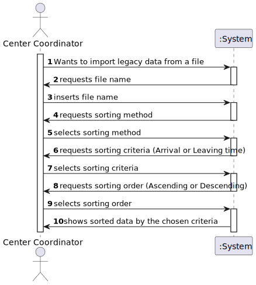
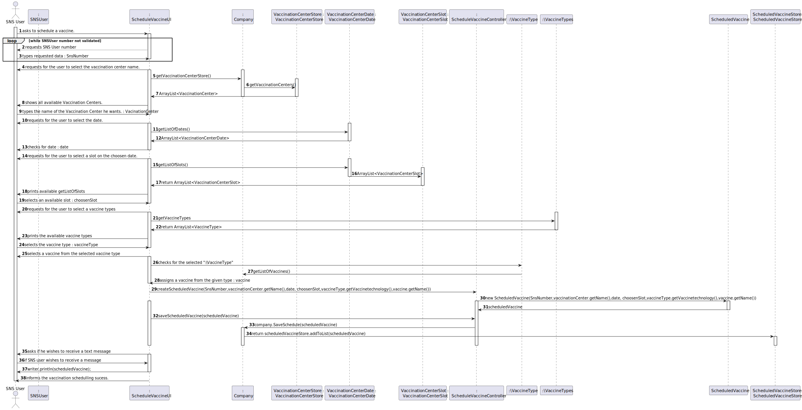
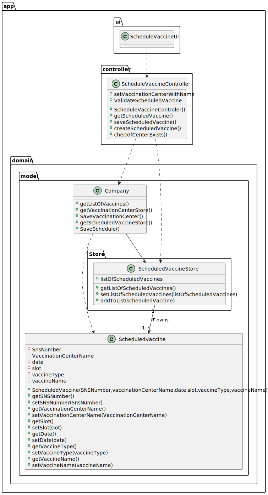

# US 17 - Import Legacy Data

## 1. Requirements Engineering

### 1.1. User Story Description

As a center coordinator, I want to import data from a legacy system that was used in the past to manage centers. The imported data should be presented to the user sorted by arrival time or by the center leaving time. The name of the SNS user and the vaccine type Short Description attribute should also be presented to the user.

### 1.2. Customer Specifications and Clarifications 

**From the specifications document:**

**From the client clarifications:**

> **Question:** "I was analysing the csv file that should be imported for US17 (the one that is in moodle), I noticed that the date attributes are written like this 5/30/2022 I thought that the date format should be DD/MM/YYYY. I also noticed, that the time is written like this, 9:43, I also thought that the time format should be written like this HH:MM, (in this case it would be 09:43). Are the date and time formats diferent for US17?"
>
> **Answer:** That file is from a legacy system, that uses a different date and time format. The date and time should be converted when loading the data into the application that we are developing.

 
> **Question:** US17: As a center coordinator, I want to import data from a legacy system that was used in the past to manage centers. The imported data should be presented to the user sorted by arrival time or by the center leaving time. The name of the SNS user and the vaccine type Short Description attribute should also be presented to the user.
[1] It should be an option to choose to either sort by arrival time or by the center leaving time? [2] Also, the algorithms should both work for each or is one for each."
> 
> **Answer:** 1- The user can choose to sort by arrival time or by the center leaving time.
2- I just answered this question. Please check my previous answer.

 
> **Question:** "I noticed that some postal codes in the address does not follow the format of XXXX-YYY. For example some of them are XXXX-Y. Are we supposed to be able to load those users as well?"
> 
> **Answer:** Yes.

> > **Question:**  "In the Sprint D requirements is stated that two sorting algorithms should be implemented and that the imported data should be sorted by arrival time or center leaving time. Should each algorithm be capable of both sortings or is one of the algorithms supposed to do one (e.g. arrival time) and the other the remaining sorting criteria (e.g. leaving time)?"
>
> **Answer:**  Each algorithm should be capable of doing both sortings. The application should be prepared to run both algorithms. The algorithm that will be used to sort data should be defined in a configuration file.

>  **Question:**  US17: As a center coordinator, I want to import data from a legacy system that was used in the past to manage centers. The imported data should be presented to the user sorted by arrival time or by the center leaving time. The name of the SNS user and the vaccine type Short Description attribute should also be presented to the user.
[1] It should be an option to choose to either sort by arrival time or by the center leaving time? [2] Also, the algorithms should both work for each or is one for each."
>
> **Answer:**  1- The user can choose to sort by arrival time or by the center leaving time. 2- I just answered this question. Please check my previous answer.

> **Question:**  "I was analysing the csv file that should be imported for US17 (the one that is in moodle), I noticed that the date attributes are written like this 5/30/2022 I thought that the date format should be DD/MM/YYYY. I also noticed, that the time is written like this, 9:43, I also thought that the time format should be written like this HH:MM, (in this case it would be 09:43). Are the date and time formats diferent for US17?"
> 
> **Answer:** That file is from a legacy system, that uses a different date and time format. The date and time should be converted when loading the data into the application that we are developing.

> **Question:** "I noticed that some postal codes in the address does not follow the format of XXXX-YYY. For example some of them are XXXX-Y. Are we supposed to be able to load those users as well?"
> 
> **Answer:** "Yes."

 
> **Question:**  "Is there any correct format for the lot number? Should we simply assume that the lot number will always appear like this 21C16-05 ,like it's written in the file, and not validate it?"
>
> **Answer:** The lot number has five alphanumeric characters an hyphen and two numerical characters (examples: 21C16-05 and A1C16-22 )

 
> **Question:** "Regarding the information to be displayed to the user is it all the information available in the legacy system file(SNSUSerNumber; VaccineName; Dose; LotNumber; ScheduledDateTime; ArrivalDateTime; NurseAdministrationDateTime; LeavingDateTime) and the name of the SNS user and the vaccine type Short Description? All of these pieces of information?"
> 
> **Answer:** Read carefully the requirements introduced for Sprint D and discuss the requirements with your team. There is nothing to clarify regarding your question.

> **Question:** "Should the vaccine named Spikevax, (the one in the given CSV file for US17), be registered before loading the CSV file?"
> 
> **Answer:** "Yes."

 
> **Question:** "In a previous answer you told us that we have to instantiate any SNS Users from the legacy file that aren't in the system, however we need at least an e-mail and a name to authenticate the User, how should we proceed?"
> 
> **Answer:**  "I already answered this question."

 
> **Question:** "You answered to a previous question saying that the user should be able to sort by ascending or descending order. Should the user choose in the UI, the order in which the information should be presented? Or should this feature be defined in the configuration file?"
> 
> **Answer:** The center coordinator must use the GUI to select the sorting type (ascending or descending).

 
> **Question:** "Should the configuration file be defined , manually, before strating the program? Or Should an administrator or another DGS entity be able to alter the file in a user interface? This question is also important for US06 and US16 since these US also use configuration files, will the same process be applied to them?"
> 
> **Answer:** The configuration file should be edited manually.

 
### 1.3. Acceptance Criteria

> * **AC1:** Two sorting algorithms should be implemented ( to be chosen manually by the coordinator), and worst-case time complexity of each algorithm should be documented in the application user manual (in the annexes) that must be delivered with the application. The center coordinator must be able to choose the file that is to be uploaded.

### 1.4. Found out Dependencies

### 1.5 Input and Output Data

**Input Data:**
* csv File

* Typed data:
  * Sorting option
  

	
* Selected data:
	* LegacyData

**Output Data:**

* Sorted LegacyData

### 1.6. System Sequence Diagram (SSD)

### 1.7 Other Relevant Remarks

## 2. OO Analysis

### 2.1. Relevant Domain Model Excerpt 

### 2.2. Other Remarks

n/a

## 3. Design - User Story Realization 

### 3.1. Rationale

**SSD - Alternative 1 is adopted.**

| Interaction ID                                                      | Question: Which class is responsible for... | Answer                                            | Justification (with patterns)                                                                                    |
|:--------------------------------------------------------------------|:--------------------------------------------|:--------------------------------------------------|:-----------------------------------------------------------------------------------------------------------------|
| Step 1 :   The SNS User wants to schedule a vaccine using the app   | 	... interacting with the user?             | ScheduleVaccineUI                                 | **Pure Fabrication:** there is no reason to assign this responsibility to any existing class in the Domain Model |
 |                                                                     | 	... coordinating the US?                   | ScheduleVaccineController                         | **Controller**                                                                                                   |
| Step 2  : Requests the SNS User number                              |                                                     
| Step 3  : Types the SNS User number                                 | 	...validating the SNS number?              | SNSUser                                           | **IE**: the object has it's own data                                                                             |
| Step 4  : Requests the vaccination center name                      | 	                                           |                                                   | 						                                                                                                           |                   |                  
| Step 5  : Types the vaccination center name                         | 	... validate the vaccination center name?  | VaccinationCenterStore                            | **IE**: knows all of the existing vaccination centers names.                                                     |
| Step 6  : Requests the date for the vaccination	                    |                                             |                                                   |                                                                                                                  |   
| Step 7 :  Types the date for the vaccine scheduling                 | 	... validate the scheduling date?          | VaccinationCenterDate                             | **IE:** an object knows its data                                                                                 |
 | Step 8 : Requests the slot to be vaccinated                         |                                             |                                                   |                                                                                                                  | 
| Step 9 : Selects the slot to be vaccinated                          | ... check if the slot is available?         | VacinationCenterDate                              | **IE:** the object has it's own data                                                                             |
| Step 10 : Requests the vaccine type to get vaccinated               | 	                                           |                                                   |                                                                                                                  |        
| Step 11 : Selects the vaccine type                                  | 	... check if the vaccine type exists?      | VaccineTypes                                      | **IE:** Store knows all of the existing vaccine types.                                                           |
| Step 12 : Assigns a random vaccine from that vaccine type           | 	... get a random vaccine                   | AddNewVaccineController                           | **Controller:**                                                                                                  | 
| Step 13  : Creates a scheduled vaccine with the requested datd      | 	... creating the scheduled vaccine?        | ScheduleVaccineController                         | **Controller**                                                                                                   | 
| Step 14  : Adds the created vaccine to a list of scheduled vaccines | 	... storing all the scheuled vaccines?     | ScheduledVaccineStore                             | **IE:** Store stores and saves all scheduled vaccines                                                            | 
| Step 15  : Validates the scheduled vaccine                          | 	... validating the vaccine?                | ScheduleVaccineController                         | **Controller**                                                                                                   | 
| Step 16  : Outputs to an external .txt file the scheduled vaccine   | 	... output the Scheduled vaccine?          | ScheduleVaccineController                         | **Controller**                                                                                                   | 

### Systematization ##

According to the taken rationale, the conceptual classes promoted to software classes are:

* Company
* SNSUser
* VaccinationCenter
* VaccineType
* Vaccine

Other software classes (i.e. Pure Fabrication) identified:

* ScheduleVaccineUI
* ScheduleVaccineController
* ScheduleVaccineStore
* SNSUserDTO

Other software classes of external systems/components:

## 3.2. Sequence Diagram (SD)

## 3.3. Class Diagram (CD)

# 4. Tests 

**Test 1:** Check that it is not possible to create a scheduled vaccine with null parameters. 

	void checkNullScheduledVaccine() {
        ScheduledVaccineController controller = App.getInstance().getCompany().getScheduledVaccineController;

        Assertions.assertThrows(NullPointerException.class, () -> {
            controller.checkScheduledVaccine(new ScheduledVaccine(null,null,null,null,null,null));
        });
    }
	

**Test 2:** Check that it is not possible to schedule the same vaccine type more than once. 

	@Test(expected = AlreadyExistsException.class)
		public void checkIfScheduleExists(ScheduledVaccine scheduledVaccine) {
		ArrayList<ScheduledVaccine> list = App.getInstance().getCompany().getScheduledVaccineStore.getListOfScheduledVaccines
        
        for (ScheduledVaccine scheduled : list){
        if (scheduled.getVaccineType.equals(scheduledVaccine.getVaccineType)
            throw Exception;
        }

	}

*It is also recommended to organize this content by subsections.* 

# 5. Construction (Implementation)

## Class ScheduleVaccineController

## Class Company

## Class ScheduledVaccineStore

# 6. Integration and Demo 

# 7. Observations

